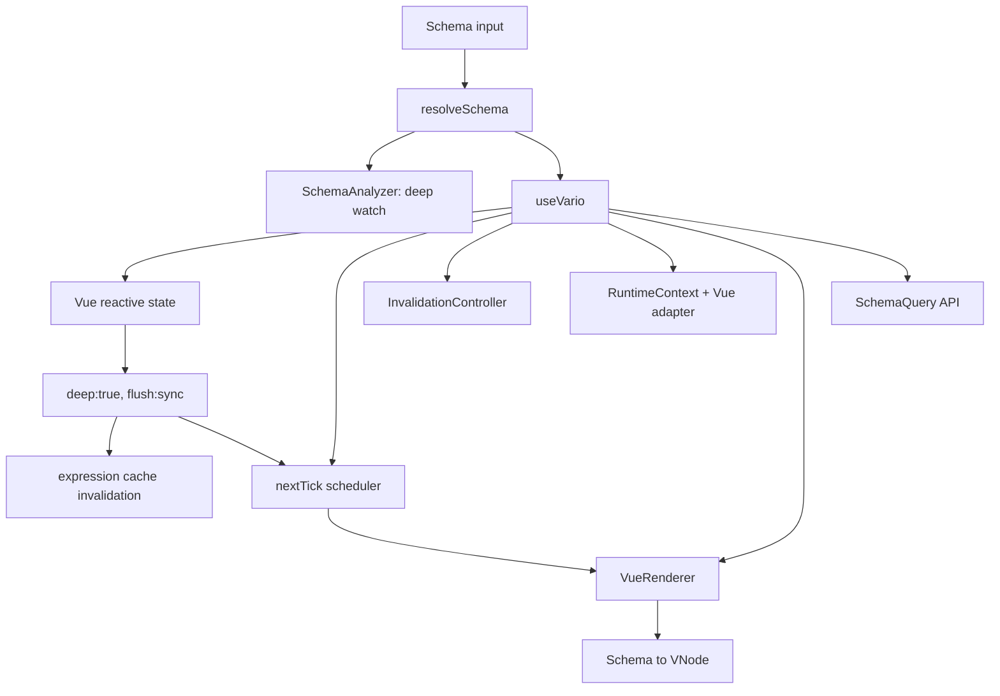

# 当前源码架构与复杂度

> 结论入口：[审计总览](./index.md)  
> 风险详情：[生产适用性](./production-readiness.md)

## 1. 包边界：概念合理，依赖声明失真

源码实际依赖方向是：

```mermaid
flowchart LR
    Types[@variojs/types]
    Core[@variojs/core]
    Schema[@variojs/schema]
    Vue[@variojs/vue]
    CLI[@variojs/cli]

    Core --> Types
    Schema --> Types
    Schema --> Core
    Vue --> Types
    Vue --> Core
    Vue --> Schema
    CLI --> Schema
```

这个划分本身适合继续演进：types 是契约、core 是框架无关运行时、schema 是输入边界、vue 是适配器、cli 是工具层。96 个源码文件没有发现文件级 import cycle。

但 manifest 人为制造了 `core ↔ schema`：

- `packages/vario-core/package.json:22-27` 声明依赖 schema，Core 源码实际没有导入 schema。
- `packages/vario-schema/package.json:34-38` 真实依赖 Core 的 parser/validator 能力。
- `scripts/build.mjs:19-29` 因此维护两阶段 JS/DTS “破环”构建。
- CLI 源码只直接需要 schema 与 Commander，manifest 却额外依赖 core/vue。

第一步应删除虚假依赖，而不是继续增强复杂构建器。

### 公共 API 面远大于三个主入口

当前 `package.json#exports` 只开放每个包的根入口，但根入口重导出了大量值和类型。“使用方式不变”必须保护下表全部 surface，不能只测 `useVario/defineSchema/execute`：

| 包 | 当前根出口类别 | 代表性公开项 |
|---|---|---|
| `@variojs/core` | Runtime/Path/Loop/Expression/VM/Error/Schema Query 值与类型 | `createRuntimeContext`、`createLoopContext/releaseLoopContext`、`parsePathCached`、`evaluateExpression`、cache helpers、`execute`、error classes、`findNode/createQueryEngine` |
| `@variojs/schema` | Types/Error/Validator/Normalizer/Transform | `SchemaNode`、`validateSchema*`、`normalizeSchema*`、`clearNormalizationCache`、`defineSchema/extractSchema` |
| `@variojs/vue` | renderer/composable/bindings/adapter/types/features/plugins 的 star exports | `useVario`、`VueRenderer`、model bindings、refs/teleport/provide-inject、`defaultPlugins` 与 plugin helpers |
| `@variojs/cli` | Commander program 与 programmatic API | `program`、`startDevServer`、`generateCode`、`validateFiles` 及相关 options/results |

目标架构允许新增子出口，但必须继续保留根出口重导出。准确 baseline 应由 Phase 0 对源码、d.ts、tarball 机器生成，不手工维护一份可能过期的名称清单。

## 2. `useVario` 当前组装链



源码：

- 总编排：`packages/vario-vue/src/composable.ts:94-154`
- State/Context/Renderer：`packages/vario-vue/src/composables/internal/use-vario-phases.ts:45-177`
- 错误包装：同文件 `:181-228`
- Schema/State watcher：同文件 `:233-268`

### 状态更新实际发生了什么

```text
state.x = value
  -> Vue deep watch 同步执行
  -> 失效表达式缓存
  -> nextTick 调度 renderer.render(rootSchema)
  -> 从根重新创建 VNode
  -> Vue 再做 VNode diff / DOM patch
```

它不是节点级更新。表达式缓存只减少部分表达式求值；Schema 遍历、attrs/children 创建、loop 展开、parentMap 注册仍会发生。

`ctx._set` 还有第二条写入链：

```text
ctx._set
  -> adapter.set 触发 flush:sync deep watch
  -> invalidateCache
  -> onStateChange 才 markSkipOnce
```

`markSkipOnce` 设置得太晚，已经来不及跳过当前 watch，反而会吞掉下一次直接 `state.x=`。锚点：

- Core 写顺序：`packages/vario-core/src/runtime/create-context.ts:80-93`
- Vue mark：`packages/vario-vue/src/composables/internal/use-vario-phases.ts:106-116`
- sync watch：同文件 `:250-268`

## 3. Schema → VNode 渲染链

主路径位于 `packages/vario-vue/src/renderer.ts:195-268`：

```text
validate shape
  -> registerParentMap
  -> cond/show
  -> shouldComponentize
  -> loop
  -> resolve component
  -> resolve model path
  -> build attrs/events/model
  -> resolve children/slots
  -> h()
  -> ref/directives/plugins
```

### 两套渲染管线

达到组件化阈值后，节点进入 `VarioNode`：`packages/vario-vue/src/features/vario-node.ts:137-304`。该组件又复制了一套 cond/show/component/attrs/children/ref/plugin 流程。

两套管线已经发生行为漂移：

- 普通路径在 `renderer.ts:403-412` 调用 `withDirectives`。
- VarioNode 路径在 `vario-node.ts:291-299` 只处理 ref 与 plugin，遗漏 directives。

同一节点仅因后代是否达到 5 个，功能语义就可能改变。这不是可维护的组件边界。

### parentMap 为何是 O(N²)

每个 child 创建时都携带完整 siblings 数组：`children-resolver.ts:62-71`。`registerParentMap` 不只登记当前 child，还再次遍历全部 siblings：`renderer.ts:274-285`。

平铺 N 个子节点时近似执行 N×N 次 `WeakMap.set`：

| N | 实测 set 次数 |
|---:|---:|
| 100 | 10,303 |
| 500 | 251,503 |
| 1000 | 1,003,003 |

父索引应在 Schema prepare 阶段单次 O(N) 构建。

## 4. Loop 当前链路

`packages/vario-vue/src/features/loop-handler.ts:51-186`：

```text
evaluate items
  -> clone schema for every item
  -> delete loop/model
  -> recursively mark loop schema
  -> allocate path stack/nodeContext/closure
  -> create LoopItemCell or inline VNode
```

即使使用稳定 key，每轮生成的新 `childSchema`、路径数组、nodeContext 和函数 prop 都会让每个 `LoopItemCell` 更新。稳定 key 只能复用实例，不能跳过 render。

Loop 的局部 scope 又通过 `Object.create(parentCtx)` 建立：

- Core VM：`packages/vario-core/src/runtime/loop-context-pool.ts:96-114`
- Vue inline loop：`packages/vario-vue/src/features/loop-handler.ts:151-168`
- Vue cell：`packages/vario-vue/src/features/loop-item-cell.ts:49-79`

简单表达式 compiler 将 `item`/`item.name` 编译成 `ctx._get(...)`，而 `_get` 闭包只读取父状态/adapter，绕过局部 own property：`packages/vario-core/src/expression/compiler.ts:106-143`。这是当前 loop 回归的根因。

Core 的所谓对象池也没有复用 loopCtx：它仍每次 `Object.create`，release 时用 `for...in` 枚举父上下文全部状态，并把 prototype 指向 parent 的对象放入全局池。复杂度和引用关系都与注释相反。

## 5. RuntimeContext 与状态写入

创建链：`packages/vario-core/src/runtime/create-context.ts:42-106`。

```text
validate top-level initial keys
  -> construct ctx/_get/_set/$emit/$methods
  -> register built-in action handlers into $methods
  -> wrap ctx with Proxy
```

当前存在四条不一致写通道：

1. `ctx._set(path, value)`：写、缓存失效、onStateChange。
2. `ctx.foo = value`：普通 Core 下不失效表达式缓存。
3. `ctx.nested.foo = value`：不经过 Proxy 顶层 set，也不失效。
4. 数组 action：直接 mutate `_get()` 返回的数组，只手工失效缓存，不触发 `onStateChange`。

结果是 Core、Vue adapter、直接属性写和 VM 数组 action 的通知语义不同。中大型系统无法在此基础上实现可靠的事务、审计或 time travel。

路径写入还有三项边界缺失：

- 未拒绝 `__proto__/constructor/prototype`：`runtime/path.ts:243-313`。
- 数组大索引用 `while push` 补齐：同文件 `:270-273,304-306`。
- 超过 20 段只返回 `false`，`_set` 忽略失败仍发回调：同文件 `:243-249` 与 `create-context.ts:80-93`。

## 6. 表达式链

`packages/vario-core/src/expression/evaluate.ts:33-77`：

```text
result cache lookup
  -> Babel parse
  -> AST whitelist validation
  -> simple compile or recursive interpreter
  -> dependency extraction
  -> result cache write
```

关键结构问题：

- compiled cache 查询发生在 parse/validate 之后，不能消除重复 parse。
- 结果缓存按 context 隔离，同一页面计划不能被多页面共享。
- cache key 没有安全策略 fingerprint。
- validator 与 evaluator 各维护一份白名单并已漂移。
- evaluator 允许 `reverse/sort` 和根命名空间任意静态方法，表达式不再是纯查询。
- 缓存依赖只检查路径存在，不检查版本；正确性依赖所有写入都主动失效，而现实不是。

## 7. Action VM 链

`packages/vario-core/src/vm/executor.ts:38-239`：

```text
execute
  -> create local deadline/step counter/AbortController
  -> for each action
  -> ctx.$methods[action.type]
  -> handler(ctx, action)
  -> Promise.race(handler, timeout)
```

`if/loop/batch` 再次调用公开 `execute`，每个子调用重新创建预算：

- `vm/handlers/if.ts:43-51`
- `vm/handlers/loop.ts:59-92`
- `vm/handlers/batch.ts:31-43`

因此 maxSteps 不是执行树全局限制，timeout 也只让上层 Promise 提前 reject；底层 handler 仍可在超时后继续写状态。`batch` 注释声称原子性，实际既不回滚，又会收集错误后继续执行。

## 8. Schema 契约链

```text
TypeScript SchemaNode
  -> validator
  -> normalizer
  -> renderer / query / CLI
```

当前四层没有共享一个 discriminated contract：

- Types 允许五类 EventHandler；validator 只接受 action object 数组。
- validator 只检查 action.type 是 string，不校验各 action payload 或未知 type。
- normalizer 从字段白名单重建对象，丢 `id/directives/slot/ref/lifecycle/provide/inject/teleport/transition/keepAlive/extensions`。
- normalizer 丢 `model.default/lazy/modifiers`，还删除合法空字符串和数组 null。
- analyzer 依赖 node.id 建索引，但 defineSchema 先经 normalizer 丢 id。
- `clearNormalizationCache()` 是空实现。

源码锚点：

- Event 类型：`packages/vario-types/src/schema.ts:351-366`
- Event 验证：`packages/vario-schema/src/validator.ts:141-159`
- Normalizer：`packages/vario-schema/src/normalizer.ts:39-114`
- ID index：`packages/vario-core/src/schema/analyzer.ts:71-75`

## 9. 当前复杂度总表

设 N=Schema 节点数，L=loop 项数，T=loop 模板后代数，K=父状态字段数，E=表达式缓存项，D=深度。

| 路径 | 当前复杂度 | 中大型影响 |
|---|---|---|
| Schema 根 render | O(N + 表达式成本) | 任意状态变化重建整树 |
| parentMap 平铺 children | O(N²) | 宽表单/画布明显放大 |
| loop render | O(L×T) + 不稳定 props | 单项变化仍更新全部 cell |
| Core VM loop release | O(L×K) | 大 state 即使空 body 也可数秒 |
| 表达式 cache invalidation | O(E×deps) | 每次写扫描，最大 E=100 |
| 生产 direct state invalidation | O(topKeys×E×deps) | 没有精确 onTrigger 路径 |
| Schema analyze | 通常 O(N)，深树递归 O(D) 栈 | 5000 深度可栈溢出 |
| findNode | 实际近 O(N) | false 只剪当前分支，不全局停止 |
| 多页面 | O(pageCount×pageRuntime) | 无 pause/evict，注册表还全局共享 |

## 10. 值得保留的基础

尽管当前不具备生产就绪性，以下方向可保留：

- Core 源码没有 Vue import，框架边界清楚。
- RuntimeContext、表达式、VM、schema tools 已有可测试的概念分区。
- `useVario` 对外形态足够紧凑，可作为兼容 Facade。
- Schema 对象大多声明 readonly，适合向结构共享/编译计划演进。
- 大部分缓存使用 WeakMap，有转为 session-scoped 生命周期的基础。
- 现有测试数量足以作为回归资产的起点，但断言层级需要提升到真实 mount/contract/security。
