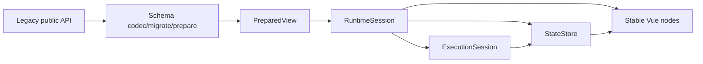

# Vario 生产内核演进执行计划

> 日期：2026-08-31 | 作者：huyongle  
> 关联规格：[spec.md](../spec.md)  
> 子方案：[当前架构](../current-architecture.md) · [目标架构](../target-architecture.md) · [实施路线](../implementation-roadmap.md) · [验收门禁](../acceptance-gates.md)

## 架构概览

保留现有公共 Facade，在内部新增 Schema prepare、RuntimeSession、Versioned StateStore、ExpressionPlan 与稳定 Vue 节点组件。Schema 结构只在 revision 变化时编译；普通 State 更新由对应 VarioNode 的 Vue render effect 精确响应。



## 关键设计决策

### 决策 1：先固化完整 public API，再替换内部执行模型

- **选择**：Phase 0 首先对所有根/子出口、值/类型、构造器、overload、返回字段和关键行为生成 API/contract baseline；`useVario/defineSchema/execute` 外观不变，内部进入 prepared/session runtime。
- **原因**：用户明确要求使用方式不变；当前包还公开了 path、loop context、cache、query、bindings 和 plugin 等多类 API，只保护三个主入口不足以证明兼容。
- **替代方案**：新 DSL 整体重写。放弃原因是迁移和回归风险过高。
- **影响**：所有新能力必须可从旧入口自动获得，additive API 不能成为基本正确性的前提；已公开的删除项必须保留 deprecated shim。唯一允许的语义收紧是已证实的安全越界或明确 bug，且必须附迁移 diagnostic。

### 决策 2：Schema 结构与 State 更新分离

- **选择**：Schema root/revision 触发 prepare；State change 只触发依赖节点。
- **原因**：当前 `deep watch → root render` 使一个叶子更新随 N 线性增长，且画布深改与 analyzer watcher 语义冲突。
- **替代方案**：继续 deep watch 并做更多 memo。无法消除全树遍历和不稳定 props。
- **影响**：画布默认采用结构共享 patch；PreparedView 成为运行时事实。

### 决策 3：显式 ScopeFrame 与 ExecutionSession

- **选择**：event/loop/slot 用 ScopeFrame，整棵 action tree 共享 ExecutionSession。
- **原因**：Object.create context 既导致别名回归和泄漏，又让嵌套 VM 重置预算。
- **替代方案**：继续修 Proxy/loop pool。无法解决 async scope 串扰与全局 deadline。
- **影响**：compiler/evaluator/VM 共享 scope 与 session 接口。

### 决策 4：Engine/Session scoped 资源

- **选择**：material/action/model/plugin/cache/pool/subscription 都归属 Engine 或 PageSession。
- **原因**：当前全局 Map/pool 会串页面、SSR 请求并保留 context。
- **替代方案**：全局表加 reset API。并发页面无法安全使用。
- **影响**：需要明确 dispose/pause/resume 生命周期；现有入口自动管理默认 Session。

### 决策 5：安全策略精确到能力与方法

- **选择**：exact allowlist、SafePathPlan、policy fingerprint、capability metadata。
- **原因**：已实证 prototype pollution、Object/Array mutation 与高权限缓存串用。
- **替代方案**：只追加 blacklist。无法覆盖未来新增原生方法和 host capability。
- **影响**：部分历史副作用表达式会被 diagnostic 拒绝，需要迁移工具。

## 代码库分析

### 现有架构约束

| 层级 | 当前实现 | 新架构适配 |
|---|---|---|
| Types | Schema/Action/Runtime 分文件，但宽泛 index signature | 保留包，收敛为 versioned/discriminated contract |
| Core | Context + expression + VM + query | 内部拆 State/Scope/Plan/Session，继续框架无关 |
| Schema | validator/normalizer/transform | 扩成 codec/migration/prepare，保持 defineSchema |
| Vue | composable + renderer + feature classes | 改为稳定组件图，useVario 继续编排 |
| CLI | Commander + JSON codegen/watch | program/bin 分离，消费统一 compiler |

### 锚点模块分析

**参考入口**：`packages/vario-vue/src/composable.ts`

| 维度 | 发现 |
|---|---|
| 入口职责 | 已按 phase 组装，可继续降级为 Facade |
| 状态 | reactive adapter 与 Core callback 双调度 |
| 渲染 | VueRenderer 和 VarioNode 双管线 |
| 错误 | 只捕获 VNode 构造，不是 descendant boundary |
| 查询 | read 可用，patch 注入 no-op |
| 生命周期 | watcher 多数依赖组件 effect scope，非组件模式缺 dispose |

### 可复用清单

| 现有模块 | 路径 | 复用方式 |
|---|---|---|
| public Facade | `vario-vue/src/composable.ts` | 保留签名，替换 phase internals |
| path parser tests | `vario-core/__tests__/runtime/path.test.ts` | 扩展 SafePathPlan regression |
| expression parser | `vario-core/src/expression/parser.ts` | Phase 1 作为 compiler backend，后续可替换 |
| error hierarchy | `vario-core/src/errors.ts` | 收敛重复类型后继续使用 |
| schema analyzer tests | `vario-core/__tests__/schema/*` | 改迭代遍历与 ID semantics |
| Vue component resolver | `vario-vue/src/features/component-resolver.ts` | 接入 MaterialManifest，保留 cache 外观 |
| plugin hooks | `vario-vue/src/plugins/types.ts` | 保留 wrap/decorate，追加 lifecycle |

### 需要变更的已有模块

| 模块 | 变更 | 原因 | 风险 |
|---|---|---|:---:|
| RuntimeContext | 委托 StateStore/Scope | 统一写入与 lexical scope | 高 |
| evaluator/cache | 改 Plan + policy | 安全与101 cliff | 高 |
| VM executor/handlers | 共享 ExecutionSession | deadline/steps/cancel/atomicity | 高 |
| validator/normalizer | 单一契约/结构保留 | 输入边界与字段丢失 | 高 |
| Vue renderer | 稳定 node component graph | 全树更新与双管线 | 高 |
| loop | LoopRegion/Cell | correctness、O(N)、虚拟化 | 高 |
| CLI/publish | 真实 bin/clean artifact | 发布可信度 | 中 |

## 模块/组件设计

### PreparedView Compiler

- **职责**：把 versioned document 转为稳定、只读、可增量 patch 的运行计划。
- **对外接口**：`prepareView(input, options): PrepareResult`。
- **依赖**：codec、material registry、ExpressionPlan compiler。
- **数据流**：document → migrate/validate → index/compile → PreparedView + diagnostics。

### RuntimeSession

- **职责**：持有单页 state/scope/cache/execution/subscription 生命周期。
- **对外接口**：由 `useVario` 内部创建；additive `pause/resume/dispose`。
- **依赖**：StateStore、ExecutionSession factory、DiagnosticSink。

### VarioNode Graph

- **职责**：在 Vue render effect 内按 PreparedNode 依赖读取状态并输出 VNode。
- **对外接口**：内部稳定组件 `runtime + nodeId`。
- **依赖**：RuntimeSession、material/component registry。

### PageSessionManager

- **职责**：多页面 active/inactive/paused/disposed、预算与 eviction。
- **对外接口**：additive engine API；单页 useVario 自动使用默认 page session。

## 数据模型

N/A。当前任务不涉及数据库；持久化数据模型是 `SchemaDocument v1` JSON codec 与 migration，定义见 [目标架构](../target-architecture.md#版本化-schemadocument)。

## API 契约

N/A

本方案不新增 HTTP API，因此不适用请求/响应体和 HTTP 错误码。下方是需要保持的公共 TypeScript 契约，它们的失败通过 typed diagnostic/error 表达。

不做 breaking public API 变更。以各包 `src/index.ts`、`package.json#exports`、生成 d.ts 与当前 tarball 的并集为基线，不只是下列三个主入口：

```typescript
useVario(schema, options)
defineSchema(config)
execute(actions, ctx, options)
```

允许 additive：

```typescript
createVarioEngine(options)
result.pause()
result.resume()
result.dispose()
options.onSchemaPatch?.(patch)
```

已公开的 `clearNormalizationCache`、`createLoopContext/releaseLoopContext`、`defaultPlugins`、query 返回字段和 Vue feature/plugin exports 都进入 API snapshot。内部实现可替换，但兼容版本线不删签名；必要时使用 deprecated shim。

## 迁移策略

1. Characterization tests 固化 legacy 合法行为。
2. 修 P0 后发布 patch/canary。
3. Prepared runtime 先 shadow compile，再双引擎对比。
4. 裸 Schema 自动从 legacy v0 migration 到 `SchemaDocument v1`。
5. 可信小页灰度；中型页、画布、不可信 Schema 分别准入。
6. legacy runtime 至少保留两个 minor 版本，且只有完整 API/contract/browser fixture 和使用量证明可移除时才进入 major-version 废弃流程。

## 测试策略

| 层级 | 覆盖 | 工具 |
|---|---|---|
| 单元测试 | path/policy/plan/store/session/action/codec | Vitest |
| Contract | types-validator-normalizer-runtime golden matrix | Vitest + fixtures |
| 集成测试 | Vue mount/render count/lifecycle/error/loop/model/ref | Vue Test Utils + browser |
| Browser | DOM commit/INP/long task/memory | Playwright/Chrome CDP |
| SSR | renderToString→hydrate/teleport/request isolation | Vue SSR + browser |
| Consumer | ESM/types/subpath/peer/bin | npm/pnpm pack empty projects |

## 时间/工作量估算

| 工作流 | 参考工程量 | 依赖 |
|---|---:|---|
| Phase 0 阻断修复 | 15～20 人日 | 无 |
| Prepared/Session Core | 15～25 人日 | Phase 0 |
| Vue 节点级 renderer | 20～30 人日 | PreparedView/StateStore |
| Canvas/Page/Material | 20～30 人日 | Vue renderer |
| SSR/Security/Release hardening | 10～20 人日 | 前三阶段 |

## 回滚方案

- Prepared runtime 由内部 mode flag 控制，调用方代码不变。
- migration 保留 original document 与 previous version。
- canary 超过 error/perf/heap 门槛立即退回 legacy。
- 每个 Phase 独立提交和发布，不在重构同时新增无关功能。
- 详细触发条件见 [实施路线](../implementation-roadmap.md#灰度与回滚方案)。
