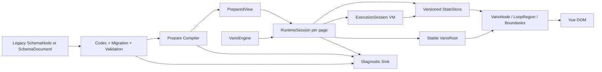

# 目标架构：兼容 Facade + 编译计划 + Session Runtime

> 设计目标：对外调用方式不变，内部从“每次状态变化解释整棵 Schema”演进为“Schema 结构只编译一次，Vue 节点按真实依赖更新”。

## 1. 方案对比

### 方案 A：只修 bug 并扩大缓存

- 实现：修 loop、pollution、lifecycle；把缓存从 100 调大；保留根 render + deep watch。
- 优势：改动小，能最快恢复测试。
- 劣势：全树重建、O(N²) parentMap、多页面生命周期、Schema 演进仍未解决；规模越大越依赖偶然够快。
- 适用性：只适合 Phase 0 止血，不是目标架构。

### 方案 B：在现有包内引入 PreparedView 与 RuntimeSession

- 实现：保留 `useVario/defineSchema/execute`，Schema 先验证/迁移/编译成稳定计划；每个页面创建隔离 Session；Vue 用稳定组件边界按依赖更新。
- 优势：修复正确性和性能根因；可分阶段灰度；现有调用方无需迁移。
- 劣势：需要重写内部渲染热路径、VM 子执行和缓存；必须先补 contract/golden/browser tests。
- 适用性：与当前代码基础和用户兼容约束最匹配。

### 方案 C：新 DSL / 新运行时整体重写

- 实现：废弃现有 Schema/Context/VM，从编译器和 bytecode 重建。
- 优势：边界最干净。
- 劣势：现有用户语法、测试和生态无法自然迁移；一次性风险最高；容易在重写期间重复已有 bug。
- 适用性：当前不选。只有方案 B 的 compiler/runtime 接口稳定后，才评估是否独立成新包。

### 选型

选择方案 B。优先级依据：正确性 > 兼容性 > 可验证性 > 性能 > 抽象纯度。

## 2. 目标全景



核心原则：

- Schema 结构变化与 State 值变化走两条不同路径。
- 所有可变资源属于 Engine 或 Session，不属于模块全局。
- 所有状态写入经过同一 StateStore。
- 所有表达式先变成带策略、依赖和成本信息的 ExpressionPlan。
- Vue 只渲染受影响节点，不再用 deep watch 猜变更路径。

## 3. 包依赖与职责

```text
@variojs/types
  ↑
@variojs/core
  ↑
@variojs/schema

@variojs/vue → types + core + schema
@variojs/cli → schema (+ types)
```

### `@variojs/types`

只包含可序列化契约和运行时接口：

- `SchemaDocument`、`SchemaNode`、`NodeId`、`SchemaVersion`
- discriminated `BuiltInAction` 与可扩展 `CustomAction`
- `MaterialManifest`、`CapabilityManifest`
- `PreparedView`/`PreparedNode` 的只读接口
- diagnostics/event payload，不包含实现

禁止运行时代码与其他 Vario 包依赖。

### `@variojs/core`

- `StateStore`：read/write/mutate/batch/version/subscribe/dispose
- `ScopeFrame`：event/loop/slot 的显式 lexical scope
- `ExpressionPlan`：parse/validate/dependencies/purity/cost/evaluate
- `ExecutionSession`：deadline/steps/signal/journal/call stack
- 迭代式 schema index/query 工具
- Engine/Session 基础设施与 diagnostics ports

Core 不依赖 schema 包，也不 import Vue。

### `@variojs/schema`

- Legacy Schema 与 `SchemaDocument` codec
- version migration registry
- 统一 validator：结构、action、material、expression policy
- 结构保留 normalizer
- prepare compiler：Schema → `PreparedView`
- 增量 patch compiler

Schema 依赖 Core 的 ExpressionPlan compiler，形成单向 `schema → core`。

### `@variojs/vue`

- Vue `StateAdapter`
- 稳定的 `VarioRoot/VarioNode/LoopRegion/LoopItemCell/ErrorBoundary/LifecycleBoundary`
- component/material resolver
- ref、Teleport、Transition、KeepAlive 的 Vue adapter
- PageSession 与 Vue effectScope 生命周期绑定

### `@variojs/cli`

- 只消费 schema codec/compiler
- 按页面相对路径输出，不共享固定 `schema.ts/types.ts`
- schema migrate/validate/compile/inspect 子命令
- bin 与 programmatic API 分离，不在库函数中 `process.exit`

## 版本化 SchemaDocument

保持裸 `SchemaNode` 输入兼容；内部先适配成 legacy v0，首个正式持久化契约固定为 `SchemaDocument v1`：

```typescript
interface SchemaDocument {
  readonly schemaVersion: number
  readonly id: string
  readonly root: SchemaNode
  readonly initialState?: JsonObject
  readonly materials?: Readonly<Record<string, string>>
  readonly extensions?: JsonObject
}
```

处理链：

```text
SchemaNode legacy
  -> wrap as v0 document
  -> migrate v0 -> v1
  -> validate
  -> normalize known fields without dropping unknown namespaced extensions
  -> prepare
```

### Node identity

- 新文档中的每个画布节点应持久化 stable `id`。
- Legacy 无 id 时，compiler 生成 path-based ephemeral id，不回写调用方对象。
- duplicate id 是 validation error，不能后写覆盖。
- Vue key、parent index、query、patch、diagnostic 都使用 nodeId，不使用可变化的路径字符串。

## 5. PreparedView

Schema 根 revision 改变时单次 O(N) 编译：

```typescript
interface PreparedNode {
  readonly id: NodeId
  readonly parentId?: NodeId
  readonly childIds: readonly NodeId[]
  readonly componentType: string
  readonly staticProps: Readonly<Record<string, unknown>>
  readonly dynamicProps: Readonly<Record<string, ExpressionPlanId>>
  readonly textPlan?: TextPlan
  readonly conditionPlan?: ExpressionPlanId
  readonly showPlan?: ExpressionPlanId
  readonly eventPlans: Readonly<Record<string, ActionPlanId>>
  readonly modelPlans: readonly ModelPlan[]
  readonly featureFlags: number
}

interface PreparedView {
  readonly revision: number
  readonly rootId: NodeId
  readonly nodes: ReadonlyMap<NodeId, PreparedNode>
  readonly expressions: ReadonlyMap<ExpressionPlanId, ExpressionPlan>
  readonly actions: ReadonlyMap<ActionPlanId, ActionPlan>
  readonly diagnostics: readonly Diagnostic[]
}
```

prepare 阶段完成：

- parent/children/siblings/id 索引
- component/material resolution validation
- props 深度表达式扫描
- event normalization
- model path tokenization
- expression parse/validate/dependency extraction
- action payload validation/plan
- static subtree 标记

渲染热路径不再 clone Schema、递归 mark loop 或 parse path/expression。

Prepared compiler 必须使用显式 work stack：10,000 层只作为“不依赖 JavaScript 调用栈”的算法门禁，Vue mount 默认仍在 100 层前完成预算判断。计划对象以 readonly/`markRaw` 或 `shallowRef` 承载，业务 state 与 loop item 保持 reactive。详细数据结构、region 分类与任务见 [Vue 3 深层运行时专项](./vue3-deep-runtime/plans/02-prepared-expression.md)。

## 6. Versioned StateStore

现有 `ctx._get/_set` 继续工作，内部统一委托：

```typescript
interface StateStore {
  read(path: PathPlan): unknown
  write(path: PathPlan, value: unknown): void
  mutate(path: PathPlan, updater: (current: unknown) => unknown): void
  version(path: PathPlan): number
  batch(run: () => void): void
  subscribe(listener: StateChangeListener): () => void
  dispose(): void
}
```

强约束：

- Proxy 直接写、Vue reactive 写、VM set、数组 action、computed default 都走同一 mutation pipeline。
- 每次提交只发一个标准 change set，可批量 coalesce。
- path 失败抛 typed error，不允许“没写成功但通知成功”。
- 系统字段不存入 StateStore；`$event/$item/$parent` 属于 ScopeFrame。
- Vue adapter 让状态值保持 reactive，但不额外 deep watch 整份 state。

## 7. ExpressionPlan

```text
Plan cache (cross-session)
  key = expression + grammarVersion + policyFingerprint
  value = frozen AST/bytecode + exact deps + purity + cost

Session memo
  key = planId + dependencyVersions + scopeGeneration
  value = result or explicit NULL/UNDEFINED sentinel
```

规则：

- parse/validate/dependency extraction每个 policy 只做一次。
- 计划缓存不保存页面 state；可跨页面共享。
- 结果 memo 属于 Session，dispose 时释放。
- `Date.now/Math.random/event/capability` 等非纯表达式不做长期结果 memo。
- whitelist 与 evaluator 共用一个 policy registry。
- exact method allowlist，不存在 `Object.*` 根放行。
- loop/slot/event 读取显式 ScopeFrame，解决 alias 与 async 串扰。

### Parser 体积策略

短期：

- 提供 `@variojs/core/runtime` 子入口，不同步 import Babel parser。
- CLI/Worker 预编译 PreparedView。
- 运行时动态 Schema 才懒加载 expression compiler。

中期：若语法面保持有限，用 Pratt parser 替换 Babel；先用兼容 fixtures 证明语义一致，不做无安全网替换。

## 8. ExecutionSession VM

公共 API 保留：

```typescript
await execute(actions, ctx, options)
```

内部：

```typescript
interface ExecutionSession {
  readonly id: string
  readonly deadline: number
  remainingSteps: number
  readonly signal: AbortSignal
  readonly scope: ScopeFrame
  readonly journal?: MutationJournal
  readonly diagnostics: DiagnosticSink
}
```

```text
execute
  -> create one session
  -> runActions(actions, session)
      -> if/loop/batch call runChild(actions, same session)
      -> before and after await: check deadline/signal/steps
      -> state commit only if session active
```

要求：

- 内建 action 不再注册进公共 `$methods`。
- action registry 与 service/method registry 分离，使用 null-prototype Map/own lookup。
- custom handler 可选接收第三个 `{ signal, executionId, deadline }`，旧二参数函数兼容。
- timeout 后禁止任何内建 action/resultTo 再提交。
- loop 分批 yield，并对 items/body/cost 计费。
- `batch` 使用 journal commit/rollback，兑现原子语义。

## 9. Vue 更新模型

### 稳定根组件

`useVario` 返回的 `vnode` 可以改为稳定 `VarioRoot` VNode；对外仍是 `Ref<VNode|null>`。

```text
VarioRoot(runtimeSession, preparedView)
  -> VarioNode(nodeId)
      -> reads only this node's expression dependencies
      -> children by stable childIds
```

普通 state 更新不替换根 VNode；Vue render/computed 在节点内部读取 reactive StateStore，因此 Vue 原生依赖跟踪决定哪些节点更新。

稳定根不等于“每个 Schema 节点一个组件”。组件边界只对应真实动态区域和 lifecycle/error/slot/loop 等语义边界；连续静态骨架在区域内部直接创建 VNode。边界 props 只传 stable ID/key/revision，renderer/plan/session 通过 typed provide/inject 读取，禁止逐层传每轮新建的 path array、nodeContext、siblings 或 closure。

只有所有写入通道、ExpressionPlan dependency versions 与 StateBridge 都通过 mutation matrix 后，prepared mode 才可删除根 deep watch；否则必须保留 conservative fallback。专项顺序见 [Vue 稳定区域子方案](./vue3-deep-runtime/plans/03-vue-stable-regions.md)。

### 统一节点管线

只保留一套 node renderer：

```text
condition -> component -> props/model/events -> children -> directives/ref -> feature adapters
```

Lifecycle/Error/Teleport/Transition/KeepAlive 都是稳定组件或 adapter，不再复制 VarioNode/Renderer 两套逻辑。

### 真实错误边界

固定 `VarioErrorBoundary` 使用 `onErrorCaptured`，覆盖 descendant setup/render/update。错误统一携带：

```text
engineId / pageId / schemaId / revision / nodeId / actionId / expressionId / phase
```

默认 diagnostic 不记录 state 值、表达式原文或 event payload，避免敏感数据泄漏。

## 10. LoopRegion 与虚拟化

```text
LoopRegion
  -> subscribes only to items plan
  -> maintains key -> stable item scope/cell
  -> LoopItemCell(templateNodeId, scopeFrame)
```

- 禁止每轮 clone Schema。
- item/index 只更新对应 ScopeFrame generation。
- key 优先显式 `props.key`/未来兼容 `loop.key` 表达式，其次 item.id，最后 index 并开发态告警。
- 100 项以上发大列表诊断；是否虚拟化由 host adapter 决定，因为通用 renderer 不知道滚动容器、高度和可访问性要求。
- 提供 `virtual` additive option/material capability，不改变原 loop 用法。

嵌套 loop 必须在创建 cell 前按累计 `maxExpandedNodes` 预算检查；ScopeFrame 的查找顺序固定为 local → parent local → state，模板 plan 每个 revision 只编译一次。详细 key、slot、model、ref 与虚拟 adapter 合同见 [Loop/Slot 子方案](./vue3-deep-runtime/plans/04-loop-slot-regions.md)。

## 11. Canvas patch 与增量编译

画布推荐 immutable structural sharing，不依赖全树 deep watch：

```text
Canvas command
  -> Patch { nodeId, op, path, before, after }
  -> validate affected material field
  -> apply structural sharing
  -> increment document revision
  -> recompile affected node/subtree
  -> update PreparedView tables
  -> Vue only receives changed PreparedNode refs
```

同一 patch record 可用于 undo/redo、协作冲突检测和审计日志。

兼容处理：

- 传入 writable Ref 时，`NodeWrapper.patch` 更新根 ref。
- 传入 computed/只读 Schema 时，新增可选 `onSchemaPatch` 回调；未提供时抛明确只读错误，禁止 no-op。
- 深层原位 mutation 是否支持必须形成正式契约；目标默认是结构共享根替换，以避免 deep watch O(N)。

## 12. 多页面 PageSession

```typescript
interface PageSession {
  readonly id: string
  readonly state: StateStore
  readonly runtime: RuntimeSession
  activate(): void
  deactivate(): void
  pause(): void
  resume(): void
  dispose(): void
}
```

- 每页独立 model/material/action/plugin/result-cache/effect scope。
- `deactivate` 保留 UI 状态但暂停非必要订阅与异步任务。
- 超出页面/内存预算时按 LRU dispose；文档状态由外层 store 持久化。
- Vue `onActivated/onDeactivated/onUnmounted` 自动映射。
- SSR 每请求创建独立 Engine/Session，不共享可变 registry。

Vue 3.4 以 `effectScope.stop()` 和订阅门控为最低兼容线，Vue 3.5 的 pause/resume 通过 feature detection 使用；不得为省事静默提高最低 Vue 版本。Prepared plan 可只读共享，state/result memo/ref/execution 不能跨页面或 SSR 请求共享。完整状态机、heap 与灰度策略见 [SSR/内存/灰度子方案](./vue3-deep-runtime/plans/05-ssr-memory-rollout.md)。

## 13. Material 与 Plugin 契约

```typescript
interface MaterialManifest {
  readonly type: string
  readonly version: string
  readonly props: JsonSchema
  readonly events: Readonly<Record<string, EventContract>>
  readonly slots: Readonly<Record<string, SlotContract>>
  readonly models: Readonly<Record<string, ModelContract>>
  readonly capabilities?: readonly string[]
  readonly migrations?: readonly MaterialMigration[]
}
```

Plugin 保留现有 `wrapComponent/decorateVNode`，追加可选 lifecycle：

```text
setup(engine) / validate(document) / prepare(node) / dispose()
```

所有 plugin/material registry 属于 Engine。现有公开可变 `defaultPlugins` 在兼容版本线中保留为 deprecated facade：新 Engine 创建时只读取它的快照，之后页面之间不再共享可变数组。删除该 facade 只能在未来 major 版本进行。

## 14. Observability

定义供应商无关、默认 no-op 的端口：

```typescript
interface DiagnosticSink {
  emit(event: VarioDiagnosticEvent): void
}
```

事件至少包含：

- schema load/migrate/validate/prepare/patch
- render root/node/loop/mount/update/error
- action start/end/error/cancel/rollback
- expression hit/miss/evaluate/error/evict
- page activate/deactivate/dispose
- plugin/material resolve/error

采样和 payload 脱敏由 Engine policy 控制。

## 15. 包出口与发布

保持根入口，同时增加：

```text
@variojs/core/runtime
@variojs/core/expression
@variojs/core/vm
@variojs/core/schema-tools
@variojs/schema/codec
@variojs/schema/compiler
@variojs/vue/plugins
```

- Vue 写入 peerDependencies。
- manifest 是发布事实，不在 publish 脚本临时变换。
- 每次发布 clean build，不允许复用旧 dist。
- pack-install smoke 在空 consumer 中验证 ESM/types/peer/bin/subpaths。
- Phase 0 实施前从各包 `src/index.ts`、`package.json#exports`、d.ts 和当前 tarball 生成 public API baseline；所有后续 Phase 都与该基线比较，不等到 Phase 4。

## 公共兼容矩阵

| 现有 public surface | 目标行为 | 验证方式 |
|---|---|---|
| `@variojs/core` 根出口 | runtime/path/loop/expression/VM/errors/schema-query 的值、类型、名称和签名保留 | d.ts/API Extractor snapshot + 每个 value export import smoke |
| `@variojs/schema` 根出口 | validator/normalizer/transform/error/type 出口保留 | d.ts snapshot + contract/golden fixture |
| `@variojs/vue` 根出口 | renderer/composable/bindings/adapter/types/features/plugins 现有出口保留 | export inventory + Vue real-mount behavior fixture |
| 现有包子出口/深导入 | 已在 `package.json#exports` 允许的路径保留；新子出口仅 additive | tarball empty-consumer matrix |
| `useVario(schema, options)` | 不变，内部创建默认 Engine + PageSession | type fixture + source/browser consumer |
| 返回 `vnode/state/ctx/refs/error/stats/find/findAll/findById/retry` | 字段、可调用方式和合法输入语义保留；可 additive 增加 dispose/pause/resume | return-shape type snapshot + runtime contract |
| `defineSchema(config)` | 不变，返回 legacy-compatible view，同时可携带 document metadata | normalization/migration golden fixture |
| `execute(actions, ctx, options)` | 不变，内部使用共享 ExecutionSession | signature snapshot + VM behavior matrix |
| `ctx._get/_set/$emit/$methods` | 外观保留，写入/作用域/registry 内部重构 | RuntimeContext contract suite |
| 裸 SchemaNode | 自动适配为 legacy v0 | legacy fixture → v1 golden |
| 现有 VNodePlugin hooks | 保留，追加 lifecycle 为可选 | plugin integration fixture |
| 现有 EventHandler 五种写法 | 统一 normalize 后全部继续支持 | five-form contract matrix |
| `clearNormalizationCache()` | 修复为真正清理；即使内核改为 revision cache，也保留 deprecated shim | import smoke + stale-object regression |
| `createLoopContext/releaseLoopContext` | 签名和基本作用域行为保留，内部可委托 ScopeFrame；不再暴露全局池是实现变化 | API snapshot + nested-scope behavior fixture |
| 可变 `defaultPlugins` | 保留 deprecated facade 与创建时快照语义；新代码使用 Engine-scoped registry | pre/post-engine mutation fixture |
| unknown component 当字符串标签 | legacy/默认兼容模式继续保留；strict/untrusted 模式才升级为阻断 diagnostic | legacy/strict 双模式 browser fixture |

### 允许的兼容例外

“使用方式不变”不能要求继续执行已证明不安全或不可能正确的行为。下列收紧是显式例外，但不改变调用入口：

- 原型路径、系统字段覆盖、表达式副作用与越权 capability 从“可执行”改为 typed error/diagnostic。
- 未知 action、错误 payload、duplicate ID 从静默放行改为校验失败。
- timeout/cancel 后继续提交、失败写仍通知成功、query patch no-op 被视为 bug，不作为需要保留的语义。

每个例外必须有错误码、node/path 定位、迁移建议、release note 和 characterization fixture；其他安全合法行为不得借“安全”名义改变。
