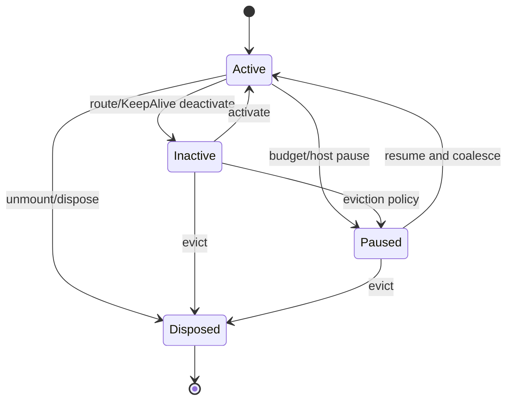

# 子方案 05：Session、SSR、内存与灰度发布

> 状态：待实施 | 阶段：Phase 4～5  
> 关联：[总方案](./README.md) · [Phase 4](../tasks/phase4-session-ssr-memory.md) · [Phase 5](../tasks/phase5-rollout-and-release.md)

## 目标

明确 Engine/PageSession/请求之间的资源所有权，验证长期驻留与 SSR 并发隔离，再通过 shadow/canary/fixed-runner/consumer matrix 把 prepared runtime 逐步投入生产。

## 资源所有权

| 资源 | 所有者 | 可共享范围 | dispose 行为 |
|---|---|---|---|
| frozen AST/ExpressionPlan | Engine immutable cache | 同 grammar+policy fingerprint | Engine 销毁或 LRU 淘汰 |
| PreparedView | immutable revision cache | 同 document/revision/material profile | 引用释放/LRU，不写回 Schema |
| result memo | PageSession | 不跨页面/SSR 请求 | 清空 |
| state/version/ChangeSet | PageSession | 不共享 | 停止写入并释放订阅 |
| ScopeFrame/LoopCell | PageSession | 不共享 | 全量 release，断开 parent 引用 |
| ref registry | PageSession | 不共享 | unmount/clear |
| material/action/plugin overlay | Engine 或 PageSession 显式层 | 不使用模块全局覆盖 | 释放 overlay |
| effect/watch/computed | PageSession effect scope | 不共享 | stop |
| timer/execution/AbortController | PageSession | 不共享 | clear/abort |
| DiagnosticSink | host/Engine | 可共享无状态 sink | flush/close 由宿主负责 |

模块全局 Map 只允许保存 immutable 且有界的 plan；任何包含 ctx/state/result/ref/用户 capability 的条目都必须归 Session。

## PageSession 状态机



- inactive：保留可恢复 UI 状态，但不执行未授权后台 action；是否继续订阅由 policy 定义。
- paused：region render/action 为 0，期间 ChangeSet 合并为一个 resume revision。
- disposed：幂等终态；任何 write/render/execute 返回 `SESSION_DISPOSED`。
- Vue 3.4 用 stop/recreate 或门控 fallback；Vue 3.5 可 feature detect scope pause/resume。两者恢复后不得重复订阅。

## SSR/hydration

每个请求必须创建新的 Engine overlay 与 PageSession：

```text
request
  → resolve immutable PreparedView
  → create request state/registry/session
  → initialize defaults before render
  → renderToString
  → serialize approved state only
  → dispose request session
```

硬约束：

- server render 不修改输入 Schema 或持久业务 state。
- model default 在 render 前的初始化 transaction 完成。
- cond/show/loop/model/error/slot/Teleport 均有 `renderToString → hydrate` fixture。
- 50 个并发请求使用不同 state/material/action/plugin 时输出完全隔离。
- Teleport target、client-only component、随机/时间值采用 deterministic contract 或 typed diagnostic。
- hydration mismatch 计为正确性失败，不能只记录 warning 后继续性能采样。

## 内存门禁

使用 Chrome CDP `collectGarbage` + heap snapshot + retainer path：

1. 预热后记录 baseline heap。
2. 1000-row loop mount/unmount 20 轮，每轮释放 Session。
3. 100 PageSession create/dispose。
4. 50 SSR request create/render/dispose。
5. 每个阶段 GC 后记录 retained bytes、对象数、斜率和前三条 retainer path。

通过条件：

- disposed Session 的 effect/timer/subscription/execution/ref/cell 数均为 0。
- 100 Session retained 增量 `≤5MB` 且后半段斜率趋近 0。
- loop 与 SSR 场景无持续增长斜率。
- 不用单点 `performance.memory` 代替 snapshot/retainer 证据。

## 观测契约

| 事件 | 最小字段 | 禁止字段 |
|---|---|---|
| prepare | page/plan/revision/nodes/duration/diagnostic counts | Schema 原文 |
| render | session/region/render count/duration | state 值、表达式原文 |
| cache | cache kind/hit/miss/evict/size | cache value |
| lifecycle | session/from/to/resource counts | 用户标识与业务 payload |
| action/error | execution/node/code/phase/duration | token、完整 event、默认完整 stack |
| canary | runtime mode/parity/perf/heap/rollback reason | 敏感租户数据 |

DiagnosticSink 默认 no-op，支持采样和背压；sink throw 不得中断业务。

## Runtime mode 与 comparator

| Mode | DOM 输出 | Prepared 执行 | 适用阶段 |
|---|---|---|---|
| legacy | legacy | 关闭 | 现状/回滚 |
| shadow | legacy | compile/compare，不执行副作用 | Phase 1～5 |
| prepared | prepared | 完整执行 | canary/生产候选 |

Comparator 比较 canonical DOM/text/attrs、emit、state ChangeSet、refs、error/diagnostic 和 lifecycle。不得比较 VNode 对象 identity，也不得为了比较执行两次 action/service/lifecycle 副作用。

## Canary 与自动回退

```text
internal team
→ 1% trusted pages
→ 10% mixed pages
→ 50% eligible pages
→ 100% per approved capability tier
```

立即回退：correctness/parity/SSR isolation/error boundary 差异。停止扩量并评审：p95 相对锁定 budget 回退 >20%、long task、retained heap 超限、conservative region 比例异常。回退以 Session/租户为单位，保存版本、时间、reason、runner profile 和 diagnostic evidence。

## Consumer/发布矩阵

| 维度 | 矩阵 |
|---|---|
| Vue | 3.4、3.5 |
| 渲染 | CSR mount、SSR render、hydrate |
| 页面 | 200、1000 节点；D=50/100；loop 1000 virtual |
| 包 | source integration、built ESM、npm tarball |
| 类型 | vue-tsc、public d.ts snapshot、subpath imports |
| mode | legacy、shadow、prepared、forced rollback |

最终发布顺序：lint → tsc → unit → source integration → browser → SSR → heap → fixed-runner perf → bundle → pack consumer → rollback rehearsal → 文档验收。

## 实施后文档

仅当 Phase 5 真实完成时创建：

- `docs/architecture-audit/vue3-deep-runtime/verification-report.md`
- `docs/architecture-audit/vue3-deep-runtime/retrospective.md`
- 根 `CHANGELOG.md` 的实际版本条目

验收报告必须把规格 AC/gate 与原始 JSON、测试、commit 一一对应；未通过项保持未勾选并说明原因，不得用“文档完成”代替“代码完成”。

## 回滚

- 关闭当前 Session 的 prepared mode，继续使用同一 Schema/state/public Facade。
- 回滚不删除或覆盖源文档；PreparedView 只读缓存可直接丢弃。
- 若 schema migration/安全收紧与 renderer 无关，仍保持已生效的安全政策，不为性能回滚恢复漏洞。
- legacy 删除前至少完成两次独立版本的 rollback rehearsal 和真实使用量审计。

