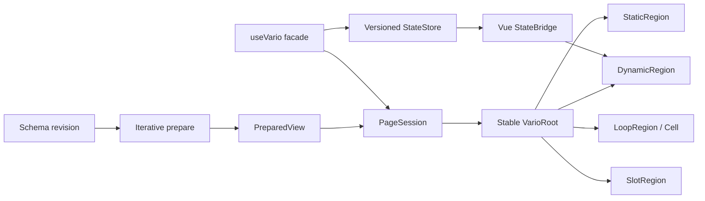
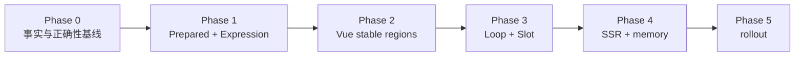

# Vue 3 深层运行时执行方案

> 日期：2026-08-31 | 作者：huyongle | 状态：待评审  
> 关联规格：[../spec.md](../spec.md)  
> 任务总览：[../tasks/README.md](../tasks/README.md)

## 架构概览

保留 `useVario` 作为兼容 Facade，内部把“Schema 结构变化”和“业务 state 变化”拆成两条通道。Schema revision 进入迭代式 compiler，形成只读 `PreparedView`；每个页面创建 `PageSession`，通过 `VersionedStateStore` 和 `ExpressionPlan` 把 ChangeSet 路由到稳定的 DynamicRegion。静态骨架不创建逐节点组件，loop 与 slot 使用独立 ScopeFrame，所有 Vue effects 和异步资源归 Session 管理。



普通 state 更新不得回到 Schema compiler 或替换根 VNode；Schema revision 也不得复用可变旧计划。首次 mount 仍需创建实际 VNode/DOM，局部化只消除无依赖区域的重复工作。

## 关键设计决策

### 决策 1：保留完整 public Facade，内部双运行时迁移

- **选择**：`useVario`、现有 overload、返回字段、根/子出口与安全合法行为保持不变；内部支持 legacy、shadow、prepared 三种 mode。
- **原因**：真实项目与低代码平台不能为了性能重构一次性改写 Schema 和所有页面调用。
- **替代方案**：发布新的 `usePreparedVario` 并要求调用方迁移。放弃，因为会形成两个长期公共模型，也无法证明旧行为兼容。
- **影响**：Phase 0 必须先生成 API/contract baseline；prepared 差异默认阻断，只有安全收紧和明确 bug 可附迁移说明后接受。

### 决策 2：用 PreparedView 统一结构事实

- **选择**：Schema 每个 revision 经显式栈 `O(N)` prepare，生成 immutable flat plan 和 parent/children/id/path/feature/region index。
- **原因**：当前 renderer、analyzer、query、loop 和 parentMap 各自递归或重复扫描，深度与复杂度不一致。
- **替代方案**：保留原始 Schema，在各 feature 中增加 WeakMap cache。放弃，因为 cache 不能统一错误、ID、区域和增量 patch 契约。
- **影响**：运行时不再直接原位修改 Schema；画布 patch 通过 revision 和结构共享生成新计划。

### 决策 3：按动态区域组件化，而不是按 Schema 节点组件化

- **选择**：只有表达式依赖、model、loop、slot、ref、lifecycle、error、provide、Teleport 等动态/语义边界成为稳定 Vue 组件；连续静态骨架合并为 StaticRegion。
- **原因**：每节点组件化会使组件数量和调用深度接近 `N/D`，实测更早栈溢出；当前不稳定 props 也无法隔离 render。
- **替代方案**：所有节点均创建 `VarioNode`。放弃，因为组件实例、effect、props、slot 与内存成本不可控。
- **影响**：compiler 必须保守分类；任何无法证明静态的节点进入 DynamicRegion，不能为了减少组件数误缓存。

### 决策 4：先建立依赖版本，再移除 deep watch

- **选择**：ExpressionPlan 记录 state/local 依赖，StateStore 为写入生成 path version 和 ChangeSet，StateBridge 再唤醒相关 token；双轨验证通过后才删除 prepared mode 的 deep watcher。
- **原因**：当前结果 cache 只检查依赖路径存在性，直接删除全量失效会产生陈旧 UI。
- **替代方案**：依赖 Vue render 自动追踪所有表达式。放弃，因为表达式 evaluator、VM、model 和异步 scope 并非都在同一个 Vue render effect 内完成。
- **影响**：所有写入通道必须收敛到 StateStore；动态依赖使用 conservative region，不能漏更新。

### 决策 5：Session 服务浅层化，业务数据保持响应性

- **选择**：PreparedView、PreparedNode、组件定义、renderer 和 Session service 使用普通只读对象、`shallowRef` 或 `markRaw`；业务 state 与 loop item 保持 Vue reactive/ref 语义。
- **原因**：深代理只读计划没有收益，但把业务 item 标记 raw 会切断真实依赖。
- **替代方案**：为了减少 watcher，把整个 RuntimeContext/state `markRaw`。放弃，因为会破坏 Vue 3 深层更新正确性。
- **影响**：需要类型封装与回归测试限制 `markRaw` 的合法对象集合。

### 决策 6：Loop/Slot 使用稳定 ScopeFrame

- **选择**：模板 plan 只编译一次，LoopRegion 按 key 维护 cell；cell/slot 只持有 scopeId/generation 和必要值，不 clone Schema 或 Object.create 整份 context。
- **原因**：当前每 item 克隆、递归标记、构建 path/context/closure，嵌套时按 `R` 乘法放大。
- **替代方案**：继续扩展 loop context pool。放弃，因为 pool 不解决别名优先级、跨 async 泄漏和 plan 重复工作。
- **影响**：ExpressionPlan lookup 顺序固定为 local → parent local → state；公开 loop context 工具保留 deprecated shim。

### 决策 7：深度安全与 DOM 支持分开定义

- **选择**：compiler 用 10,000 层 fixture 验证显式栈；默认 Vue mount 上限为 100，正常产品设计建议不超过 50。
- **原因**：编译不栈溢出不等于浏览器适合创建 10,000 层 DOM 或组件树。
- **替代方案**：只设置一个统一“最大深度”。放弃，因为会混淆算法安全、运行时正确性和产品容量。
- **影响**：diagnostic 必须标明失败 phase 与实际/限制值；超 mount depth 在创建任何 VNode 前中止。

### 决策 8：Vue 3.4 为最低兼容基线

- **选择**：以 `effectScope.stop()` 和订阅门控实现基础 dispose/pause；Vue 3.5 的 scope pause/resume 仅通过 feature detection 加速。
- **原因**：当前包兼容线包含 Vue 3.4，不能在内部静默使用 3.5-only API。
- **替代方案**：直接提高最低 Vue 版本。暂不采用，除非另行完成 breaking-change 与消费侧使用量评审。
- **影响**：CI 必须覆盖 Vue 3.4/3.5；两条路径公开行为一致。

## 代码库分析

### 当前热路径

| 热点 | 源码 | 现状 | 目标去向 |
|---|---|---|---|
| state deep watch | `packages/vario-vue/src/composables/internal/use-vario-phases.ts` | `deep:true, flush:sync` 后根调度 | `StateStore → ChangeSet → StateBridge` |
| 根递归 renderer | `packages/vario-vue/src/renderer.ts` | 每次更新重新解释 Schema | Schema revision 才 prepare，state 只更新 region |
| child error | `packages/vario-vue/src/features/children-resolver.ts` | catch 后返回 null | typed diagnostic + fixed ErrorBoundary |
| parentMap | `packages/vario-vue/src/renderer.ts` | 每个 child 重扫 siblings | prepare 单次线性索引 |
| 组件化 | `packages/vario-vue/src/features/vario-node.ts` | scope/后代数启发式 | feature/dependency region compiler |
| loop | `packages/vario-vue/src/features/loop-handler.ts` | 每项 clone/mark/context/path/closure | immutable LoopPlan + stable cell |
| lifecycle | `packages/vario-vue/src/features/lifecycle-wrapper.ts` | render 内 defineComponent | module-level fixed boundary |
| model | `packages/vario-vue/src/bindings.ts` | render 内默认写和 lazy timer | prepare/init transaction + Session timer |
| expression cache | `packages/vario-core/src/expression/cache.ts` | 依赖存在性校验 | plan cache + session version memo |
| depth/path | `packages/vario-schema/src/validator.ts`、`packages/vario-core/src/runtime/path.ts` | 100 与 20 两套限制 | versioned RuntimeBudget |

### 可复用清单

| 现有模块 | 路径 | 复用方式 |
|---|---|---|
| public Facade | `packages/vario-vue/src/composable.ts` | 保留 overload/返回，替换内部 phase |
| Vue adapter | `packages/vario-vue/src/adapter.ts` | 收敛为 StateBridge/StateStore 适配入口 |
| expression parser | `packages/vario-core/src/expression/parser.ts` | 继续生成 AST，新增 Plan metadata |
| dependency extractor | `packages/vario-core/src/expression/dependencies.ts` | 扩展 state/local/dynamic 依赖类别 |
| component resolver | `packages/vario-vue/src/features/component-resolver.ts` | 保留 resolver cache 与 markRaw 组件定义 |
| attrs/event/directive/ref/plugin | `packages/vario-vue/src/features/` | 合并为 legacy/prepared 共用 VNode pipeline |
| error hierarchy | `packages/vario-core/src/errors.ts` | 新增 typed depth/budget/session errors |
| schema analyzer fixture | `packages/vario-vue/src/features/schema-analyzer.ts` | 测试数据迁移到 PreparedView stats |
| loop cell | `packages/vario-vue/src/features/loop-item-cell.ts` | 保留行为 fixture，替换 props/scope 实现 |
| 审计 benchmark | `output/playwright/vario-audit-benchmark.js` | 提炼为 production runner 和结果 schema |

## 模块职责与依赖

| 模块 | 单一职责 | 不得承担 |
|---|---|---|
| Prepared compiler | Schema → immutable plan/diagnostic | Vue state、DOM、Session memo |
| ExpressionPlan | AST/policy/deps/purity/cost | 跨 Session 结果值 |
| VersionedStateStore | write/mutate/batch/version/ChangeSet | Vue component 调度 |
| PageSession | 单页资源所有权与生命周期 | 模块全局可变注册表 |
| StateBridge | ChangeSet → Vue region token | 表达式语义或 Schema 遍历 |
| PreparedRenderer | PreparedNode → VNode pipeline | root state deep watch |
| DynamicRegion | 按 token 读取并更新一个区域 | 递归重新 prepare 整树 |
| StaticRegion | 挂载一个无依赖静态骨架 | 跨实例复用 mounted VNode |
| LoopRegion/Cell | stable key、scope、cell diff | clone/修改模板 Schema |
| DiagnosticSink | 采样指标/错误 | 保存业务 state 或敏感原文 |

## 数据模型

N/A。该专项不引入数据库或 HTTP 持久化模型；核心数据是内存只读计划与页面 Session。TypeScript 合同见 [Prepared/Expression 子方案](./02-prepared-expression.md#类型契约)。

## API 契约

N/A

本专项没有 HTTP API。公共 TypeScript 使用方式不变：

```typescript
const result = useVario(schema, options)
```

内部允许新增 optional/additive 配置或返回能力，但不得成为正确运行的必需参数：

```typescript
interface VarioRuntimeOptions {
  runtimeMode?: 'legacy' | 'shadow' | 'prepared'
  runtimeBudget?: Partial<RuntimeBudget>
  diagnosticSink?: DiagnosticSink
}

interface UseVarioResultAdditions {
  pause?: () => void
  resume?: () => void
  dispose?: () => void
}
```

深度/预算/Session 失败使用 typed error/diagnostic，通过当前 `error`、`onError` 和诊断 sink 暴露；不引入 HTTP 状态码。

## 子方案导航

| 子方案 | 负责范围 | 对应任务 |
|---|---|---|
| [基线与正确性](./01-baseline-correctness.md) | fixture、计数器、浏览器协议、深度与错误契约 | Phase 0 |
| [PreparedView 与 ExpressionPlan](./02-prepared-expression.md) | 迭代 compiler、扁平索引、依赖版本、shadow prepare | Phase 1 |
| [Vue 稳定区域](./03-vue-stable-regions.md) | PageSession、StateBridge、Root/Static/Dynamic/Boundary | Phase 2 |
| [Loop 与 Slot 区域](./04-loop-slot-regions.md) | ScopeFrame、LoopCell、SlotRegion、虚拟化预算 | Phase 3 |
| [SSR、内存与灰度](./05-ssr-memory-rollout.md) | 资源所有权、双 Vue 版本、SSR、heap、canary | Phase 4～5 |

## 依赖 DAG 与阶段出口



| 阶段 | 出口条件 | 尚不授权 |
|---|---|---|
| Phase 0 | 错误不静默、legacy/API baseline 可重放 | 不移除 deep watch |
| Phase 1 | prepare/plan/version memo 正确，shadow 无副作用 | 不默认启用 prepared renderer |
| Phase 2 | stable root 与区域路由通过正确性/性能门禁 | 不授权大 loop/多页面生产 |
| Phase 3 | loop/slot/虚拟 adapter 语义与预算通过 | 不授权 SSR/长时驻留 |
| Phase 4 | Session、SSR、heap 隔离通过 | 不默认全量切流 |
| Phase 5 | consumer matrix、canary、回滚演练与总门禁通过 | 才可申请对应生产准入 |

## 迁移策略

1. Phase 0 只补安全网和明确正确性修复，不改变默认 runtime mode。
2. Phase 1 在开发环境执行 shadow prepare，记录 plan diagnostic，但 DOM 仍由 legacy renderer 输出。
3. Phase 2 允许按页面/租户开启 prepared canary；shadow comparator 不重复执行业务副作用。
4. Phase 3 后才允许大列表使用 prepared LoopRegion；虚拟化由宿主显式 adapter 接入。
5. Phase 4 后按 SSR/多页面准入档分别开启，不因 CSR 通过而自动授权 SSR。
6. Phase 5 按 1% → 10% → 50% → 100% 灰度；任何 correctness diff 立即回退，性能/heap 按锁定预算回退。

## 测试策略

| 层级 | 单元测试/集成测试重点 | 工具 |
|---|---|---|
| 单元测试 | iterative traversal、index、region classification、dependency version、ScopeFrame、budget | Vitest + operation counter |
| 单元测试 | StateBridge routing、Session lifecycle、component props identity | Vitest + Vue custom renderer |
| 集成测试 | lifecycle/error/slot/model/ref/directive/plugin/loop parity | Vue Test Utils + real components |
| 集成测试 | legacy/shadow/prepared DOM、event、state、diagnostic comparator | Vitest + browser fixture |
| Browser | production mount/update/DOM/long task/render count | Playwright + Chrome CDP |
| SSR | renderToString → hydrate、50-request isolation | Vue SSR + browser |
| Memory | loop/session repeat、GC、heap snapshot/retainer path | Chrome CDP |
| Consumer | Vue 3.4/3.5、CSR/SSR、ESM/types/peer/package | pnpm pack + fixture matrix |

性能用例必须先通过 correctness assertion；失败、静默截断或错误文本不能计入耗时通过。

## 时间/工作量估算

| 阶段 | 任务数 | 单人净工时 | 主要可并行块 |
|---|---:|---:|---|
| Phase 0 | 8 | 22h | fixture、runner、深度/loop 回归 |
| Phase 1 | 9 | 34h | index、region compiler、ExpressionPlan |
| Phase 2 | 9 | 34h | StateBridge/Root/Boundary，Static/Dynamic |
| Phase 3 | 9 | 34h | Scope/Plan，Loop/Slot，虚拟 adapter |
| Phase 4 | 8 | 27h | lifecycle/SSR/heap runner |
| Phase 5 | 8 | 25h | comparator/metrics，consumer matrix |
| 合计 | 51 | 176h | 不含评审等待、CI 排队和业务物料修复 |

任务粒度和依赖见 [tasks/README.md](../tasks/README.md)。176h 是实现与测试的净参考，不是生产排期承诺。

## 回滚方案

- runtime mode 是内部开关；回退到 legacy 不修改业务 Schema、state 或 `useVario` 调用。
- PreparedView 只读且由 Schema revision 派生，回退不把 plan 写回源文档。
- canary 以页面/租户为最小隔离单元；一个 Session 触发阈值只回退该单元。
- correctness、error、SSR isolation 任一差异立即回退；性能 p95 回退超过 20% 或 retained heap 超预算时停止扩量。
- legacy renderer 至少保留两个 minor 版本；删除必须进入 major-version 评审，并提供使用量和回滚窗口证据。
- 每个 Phase 独立提交和发布，禁止把 Phase 1～5 合成不可二分的大改。

