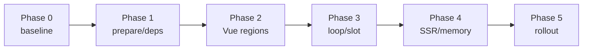

# Vue 3 深层运行时任务总览

> 日期：2026-08-31 | 状态：待实施  
> 关联规格：[../spec.md](../spec.md)  
> 执行方案：[../plans/README.md](../plans/README.md)

## 汇总

| 阶段 | 文件 | 目标 | 任务数 | 净工时 | 状态 |
|---|---|---|---:|---:|---|
| Phase 0 | [基线与契约](./phase0-baseline-and-contracts.md) | 固化事实、错误与 public baseline | 8 | 22h | 已完成 |
| Phase 1 | [Prepared 与依赖](./phase1-prepared-and-dependencies.md) | 迭代计划、ExpressionPlan、shadow | 9 | 34h | 已完成 |
| Phase 2 | [Vue 稳定区域](./phase2-vue-stable-regions.md) | Session、StateBridge、Root/Region | 9 | 34h | 已完成 |
| Phase 3 | [Loop/Slot Runtime](./phase3-loop-slot-runtime.md) | ScopeFrame、cell、slot、虚拟化 | 9 | 34h | 已完成 |
| Phase 4 | [Session/SSR/内存](./phase4-session-ssr-memory.md) | 生命周期、请求隔离、heap | 8 | 27h | 已完成 |
| Phase 5 | [灰度与发布](./phase5-rollout-and-release.md) | comparator、canary、consumer、验收 | 8 | 25h | 已完成 |
| 合计 |  |  | 51 | 176h | 51/51 |

176h 是单人净实施与测试参考，不包含方案评审、CI 排队、真实业务物料适配、灰度观察窗口和发布等待。

## 依赖 DAG



关键路径：

```text
T0.1 → T0.3 → T0.8
→ T1.1 → T1.2 → T1.3 → T1.7 → T1.8
→ T2.1 → T2.3 → T2.4 → T2.7 → T2.8
→ T3.1 → T3.3 → T3.4 → T3.5 → T3.9
→ T4.1 → T4.4 → T4.5 → T4.8
→ T5.1 → T5.2 → T5.5 → T5.6 → T5.7 → T5.8
```

## 并行分工建议

| 阶段 | 可并行工作流 | 汇合点 |
|---|---|---|
| Phase 0 | fixture/计数器、browser runner、depth/error、loop/slot | T0.8 baseline |
| Phase 1 | index、region classifier、ExpressionPlan/cache | T1.7 prepareView |
| Phase 2 | StateBridge、VarioRoot、Boundary；Static/Dynamic 两区 | T2.7 renderer |
| Phase 3 | Scope/Expression；Loop/Slot；virtual adapter | T3.9 browser/heap gate |
| Phase 4 | lifecycle compatibility、SSR、heap runner | T4.8 isolation gate |
| Phase 5 | comparator、metrics；consumer fixture 准备 | T5.5 canary controller |

任一时刻，一个共享生产文件只能由一个任务负责人修改；并行任务先通过类型/接口文件对齐再开工，避免对 `composable.ts`、`use-vario-phases.ts` 和 `page-session.ts` 产生交叉覆盖。

## 执行规则

- 所有 checkbox 初始为 `[ ]`；只有产出路径存在、验收命令通过且证据已保存才改为 `[x]`。
- 每项 2～4h；超过 4h 的实际工作必须拆出新的编号和依赖，不得只改预估。
- 先写/固化失败测试，再改生产实现；性能任务同时检查正确性、render/DOM 和原始数据。
- Phase 出口未通过时不得开始依赖其正确性的切流任务；可以并行准备不依赖实现的 fixture/runner。
- 不得为通过耗时门槛放宽算法门禁、静默错误、减少正确性断言或把业务 state `markRaw`。
- `D=10,000` 只属于 compiler 安全测试；Vue mount 仍遵守默认 `D≤100`。
- Phase 5 完成前不创建“已通过”的验收报告；报告必须链接实际 commit、命令和原始证据。

## Phase 级完成定义

| Phase | 完成定义 |
|---|---|
| 0 | legacy/API baseline 可重放；深度/loop/lifecycle/error 不再静默 |
| 1 | immutable plan、依赖版本、cache 与 shadow prepare 门禁全绿 |
| 2 | prepared mode 不注册 root deep watch，单叶按区域更新且 feature parity 通过 |
| 3 | loop 单项/slot scope/虚拟化/展开预算与 heap 正确 |
| 4 | PageSession 资源清零，Vue 3.4/3.5、SSR/hydration/isolation 通过 |
| 5 | fixed budget、consumer matrix、canary/rollback rehearsal 与总体验收完成 |

