# 运行时回退修复 执行计划

> 日期: 2026-09-03 | 作者: huyongle | 关联 spec: [../spec.md](../spec.md) | 子 plan: [core-runtime.md](./core-runtime.md)、[vue-legacy-runtime.md](./vue-legacy-runtime.md)、[prepared-runtime.md](./prepared-runtime.md)

## 架构概览

修复按依赖方向分三个 slice：先修 `@variojs/core` 的契约层（session 生命周期、缓存失效语义、路径/白名单策略、loop/scope ctx 原语），再让 `@variojs/vue` 的 legacy 运行时回到"旧缓存 + deep watch + 组件内渲染"的正确性基线并切断与 prepared 机制的隐式耦合，最后把 prepared 运行时对齐到同一套 core 原语。每个 slice 对应一个可独立合并、独立回滚的 phase；回归测试与文档收尾在第四个 phase。

```mermaid
flowchart LR
    subgraph core["Slice A · @variojs/core 契约层"]
        A1[ExecutionSession 解绑/复用规则]
        A2[evaluate 特殊变量不缓存 + proxy 失效]
        A3[ResultMemo 前缀失效]
        A4[白名单恢复 HEAD 可用面]
        A5[createScopeContext / loopParents / 词法写入]
    end
    subgraph legacy["Slice B · @variojs/vue legacy"]
        B1[显式 runtimeMode 贯穿]
        B2[VarioLegacyRoot 承载渲染]
        B3[ExpressionEvaluator 按模式分流]
        B4[事件 frame 按 id 释放]
        B5[dispose 不破坏宿主对象]
        B6[去 bridge / 去每帧深度扫描]
    end
    subgraph prepared["Slice C · @variojs/vue prepared"]
        C1[LoopItemCell ctx 生命周期]
        C2[别名进入 localDeps]
        C3[lifecycle ctx / instance / refs]
        C4[bridge 依赖匹配 + 直接改 state 路由]
        C5[默认 virtualAdapter=null / SSR ctx / engine]
    end
    core --> legacy --> prepared --> gates[Slice D · 回归门禁与文档]
```



## 关键设计决策

### 决策 1: legacy 模式表达式求值回到 `evaluate()`，不再共享 ResultMemo
- **选择**: `ExpressionEvaluator` 依据显式 `runtimeMode` 分流：legacy → `evaluate(expr, ctx)`；prepared → `evaluateExpressionPlan(plan, ctx, { memo, frame, table })`。
- **原因**: `evaluate.ts:27-66` 保留了完整的旧缓存路径，其 `invalidateCache` 双向 `matchPath` 语义与 `use-vario-phases.ts:294-310` deep watch 的 `flushPending` 路径采集是配套设计；而 `result-memo.ts:55-62` 的精确版本号只由 `recordChange` 推进，与 deep watch 完全脱节（research-report KG-2）。切断接缝比让两套失效机制互相补洞可靠。
- **替代方案**: 在 deep watch 回调里同步 `memo.bumpAll(paths)` —— 生产环境无 `onTrigger` 时拿不到路径，只能 `nextGeneration()` 全量失效，等价于无 memo 但多一层开销；且不解决"对象结果被 memo 缓存导致引用陈旧"的问题（旧路径 `cacheable = typeof result !== 'object'`）。
- **影响**: `features/expression-evaluator.ts`、`features/provide-inject.ts`、`features/loop-handler.ts`、`renderer.ts`（需接收 `runtimeMode`）；prepared 区域组件不受影响。

### 决策 2: 显式 `runtimeMode` 贯穿 renderer/evaluator/event-handler，禁止用"能否查到 PageSession"推断
- **选择**: `VueRendererOptions` 新增 `runtimeMode`，由 `initRenderer` 传入；`EventHandler`/`ExpressionEvaluator`/`LifecycleWrapper` 通过 renderer 拿到模式。
- **原因**: 现状 `expression-evaluator.ts:22`、`event-handler.ts:365`、`lifecycle-wrapper.ts:52` 都用 `getPageSessionForContext(ctx)` 是否非空决定走哪条路径；而 legacy 分支也创建 PageSession（`composable.ts:249`），loop ctx 又因 `getPrototypeOf → Object.prototype` 查不到 session（`loop-context-pool.ts:96-98`），结果是"根节点走新机制、循环内走旧机制"的分裂（research-report 风险表）。
- **替代方案**: legacy 不创建 PageSession —— 但 `pause/resume/dispose`、诊断 sink、`recordInteractionBudget` 都依赖 session；保留 session 只去掉它对求值路径的隐式影响更稳。
- **影响**: `renderer.ts`、`use-vario-phases.ts:initRenderer`、三个 feature 模块。

### 决策 3: legacy 渲染搬进 `VarioLegacyRoot` 内部组件
- **选择**: 新增 `components/legacy-root.ts`，render 函数内执行带错误边界的 `renderer.render`；`publicVnode.value` 返回 `h(VarioLegacyRoot, { key: revision.value })`；scheduler 只递增 `revision`。
- **原因**: Vue `withDirectives` 只能在 render 函数内调用（KG-14），现状 scheduler 在 `nextTick` 里直接 `render()` 导致指令丢失（KG-6）；同时宿主 getter 内渲染让宿主 effect 追踪整棵 state，形成双重渲染。prepared 分支已用同型方案（`composable.ts:206-212` `h(VarioRoot, { key: viewRevision })`），对齐后两种模式的宿主形态一致。
- **替代方案**: `pauseTracking` + `$forceUpdate`（依赖非公开 API，KG-15）；`instance.update()` 强刷宿主（仍双渲染，且 `withDirectives` 在 getter 内才生效，脆弱）。
- **影响**: `composable.ts`、`use-vario-phases.ts:createRenderWithErrorBoundary`（返回 vnode 而非写 ref）、`refs.ts` owner；`vnode.value` 形态变化写入文档。

### 决策 4: ExecutionSession 在 `execute()` 结束时解绑；loopCtx 显式挂到父 session
- **选择**: `execution-session.ts` 新增 `unbindExecutionSession(ctx)` 与 `session.active` 标志；`execute()` 的 `finally` 解绑；`existing` 分支仅在 `existing.active && !existing.cancelled` 时复用；`handlers/loop.ts` 在每次迭代 `bindExecutionSession(loopCtx, session)`，迭代结束解绑。
- **原因**: `executor.ts:56-79` 的复用逻辑本意是 `runChild` 共享最外层会话，但缺少解绑使会话永久残留（KG-1）；loop 迭代新建会话则让 deadline/steps/signal 不再共享（core 审查第 9 条）。
- **替代方案**: 用 `WeakRef`/超时清理 —— 引入非确定性；让 `getExecutionSession` 沿 `loopParents` 回落父 ctx —— 也可行，作为 `getPageSessionForContext` 的同类修复一并实现，但 loop.ts 显式绑定更直观。
- **影响**: `executor.ts`、`execution-session.ts`、`handlers/loop.ts`、`create-context.ts:assertSessionCanWrite`、既有测试 `executor.test.ts:709-716`。

### 决策 5: 作用域插槽使用独立 `createScopeContext`，与 loop ctx 解耦
- **选择**: core 新增 `createScopeContext(parentCtx, bindings)`（复用 `loop-context-pool.ts:80-99` 的 Proxy 转发，不注入 `$item/$index`，登记到 `scopeContexts: WeakSet`），导出 `isScopeContext`；`children-resolver.ts:104` 改用它；`event-handler.ts:307` 用 `isScopeContext(ctx)` 判定。
- **原因**: `createLoopContext(ctx, scope, -1)` 把插槽参数写成 `$item` 且 `$index=-1`（KG-5），并让 `attachRef/getEventHandlers` 的 in-loop 判定误触发。HEAD 的 `Object.create(ctx)` 语义就是"只多一层局部绑定"。
- **替代方案**: 恢复 `Object.create(ctx)` —— 与本次"不挂父 ctx 原型"的设计方向冲突（proxy.ts 注释明确要求 receiver 语义）。
- **影响**: `loop-context-pool.ts`（或新文件 `runtime/scope-context.ts`）、`children-resolver.ts`、`event-handler.ts`、`renderer.ts:attachRef` 的 inLoop 判定。

### 决策 6: 事件 frame 改为按 id 登记/释放，`frameStack` 只服务同步渲染期
- **选择**: `PageSession` 新增 `createEventFrame(bindings)`（parent = 当前渲染帧或 null，登记到 `frames`）与 `releaseFrame(frame)`（`releaseScopeFrame` 按 id 删除）；`event-handler.ts` 改用这两个方法，删除 `SCOPE_STALE_GENERATION` 检查。
- **原因**: 事件是异步且可交叠的，栈式 push/pop 必然泄漏（KG-10）；`scope-frame.ts:43-45` 已提供按 id 删除原语。
- **替代方案**: 事件不建 frame、`$event` 直接挂 ctx（HEAD 行为）—— 失去 prepared 词法查找的一致性，作为 legacy 降级备选。
- **影响**: `page-session.ts`、`event-handler.ts`、`__tests__/runtime/page-session.test.ts`。

### 决策 7: dispose 只断引用，不删宿主对象 key；disposed 后 `_set` 静默忽略并诊断
- **选择**: `adapter.release()` 仅 `held = null`；`page-session.ts:257-264` 不再 `delete methods[key]`；`composable.ts:303-309` 删除清空 state 的循环；`create-context.ts:_set` 与 `proxy.ts:set` 在 `isContextDisposed` 时 emit `SESSION_DISPOSED_WRITE` 并返回，不抛。
- **原因**: `isReactive(options.state)` 时复用的就是宿主对象（`use-vario-phases.ts:59-61`），删 key 等于清空 pinia/父组件状态（KG-7）；卸载后飞行中的异步 method 回写抛 `SESSION_DISPOSED` 会变成未捕获异常。
- **替代方案**: 只在 `options.state` 非用户传入时删 key —— 仍无必要，GC 会回收；保留 `execute` 抛 `SESSION_DISPOSED`（新事件不该进入已卸载页面）。
- **影响**: `adapter.ts`、`page-session.ts`、`composable.ts`、`create-context.ts`、`proxy.ts`、`errors.ts`（新增码）。

### 决策 8: ResultMemo 失效改为双向前缀匹配 + 已见依赖索引
- **选择**: `ResultMemo` 维护 `knownDeps: Set<string>`（`store` 时登记 `plan.stateDeps`），`bump(path)` 对 `knownDeps` 中满足 `matchPath(dep, path) || matchPath(path, dep)` 的依赖递增版本；结果为对象/数组或 `undefined` 时不 `store`。
- **原因**: 精确版本号漏掉父路径替换、数组整体替换、`.length`（core 审查第 4 条），与 `cache.ts:131-150` 的语义不一致；prepared 区域组件（`dynamic-region.ts:40-47`、`components/loop-item-cell.ts:61-65`）继续依赖 memo，必须修正。
- **替代方案**: 前缀树版本（research-report 方案 C）—— 复杂度高，作为后续优化；每次 bump 全量 `nextGeneration()` —— 等价于无 memo。
- **影响**: `result-memo.ts`、`plan-evaluator.ts`、`__tests__/expression/result-memo.test.ts`。

### 决策 9: 白名单恢复"白名单全局对象的静态方法放行"，`reverse/sort` 仅链式放行
- **选择**: `policy.ts` 恢复 `WHITELISTED_GLOBALS.has(root)` 放行规则（`JSON` 加入），`FORBIDDEN_OBJECT_METHODS` 保持禁止；`Math.random` 进入 `WHITELISTED_FUNCTIONS` 同时留在 `IMPURE_FUNCTIONS`；`whitelist.ts` 对 `reverse/sort` 仅当 `callee.object.type === 'CallExpression'` 时放行；`evaluator.ts:539-542` 的运行时检查同步。
- **原因**: research-report KG-4 确认这些是本次回退；字符串/数字实例方法 HEAD 也不支持，不在本次范围（spec 非目标）。
- **替代方案**: 全部放开实例方法 —— 扩大攻击面，需单独评审。
- **影响**: `policy.ts`、`whitelist.ts`、`evaluator.ts`、`__tests__/expression/whitelist.test.ts`、`__tests__/security/*`。

## 代码库分析

### 现有架构约束

| 层级 | 当前实现方式 | 新模块适配策略 |
|------|-------------|--------------|
| core 运行时上下文 | `createRuntimeContext` 返回 `createProxy` 包装的 ctx，状态经 `ReactiveAdapter` 路由；系统 API `$`/`_` 前缀保护 | 沿用；只改 `_set`/`set` 陷阱的 disposed 与特殊变量处理 |
| core 表达式 | `evaluate()`（per-ctx `cache.ts`）与 `evaluateExpressionPlan()`（session `ResultMemo`）双轨 | 保留双轨，按调用方模式选择；修正 memo 失效 |
| core Action VM | `execute → runActions → handler`，`ExecutionSession` 以 WeakMap 绑定 ctx | 沿用；补解绑与 loop 共享 |
| vue composable | `useVario` 分 8 个 phase，`use-vario-phases.ts` 承载；prepared 与 legacy 在 `composable.ts:200-267` 分支 | legacy 分支引入 `VarioLegacyRoot`，与 prepared 分支同型 |
| vue renderer | `VueRenderer` 类 + feature 模块（attrs/children/loop/event/expression/directive） | 新增 `runtimeMode` 选项并下发到 feature 模块 |
| vue prepared | `PageSession` + region 组件（`LoopRegion/LoopItemCell/DynamicRegion/StaticRegion/SlotRegion`）+ `VueStateBridge` | 只修 ctx 生命周期、依赖匹配、默认适配器 |
| 测试 | vitest；vue 用 `happy-dom` 环境注释 + `createApp(defineComponent({ setup() { useVario } }))` 挂载；core 直接调用 API | 新增回归测试沿用同一写法 |

### 锚点模块分析

**参考模块**: `packages/vario-vue/src/components/vario-root.ts` + `composable.ts:200-238`（prepared 分支的宿主形态）

| 分析维度 | 发现 |
|---------|------|
| 目录结构 | `src/components/` 放 Vue 组件，`src/features/` 放渲染管线功能模块，`src/runtime/` 放 session/bridge，`src/composables/internal/` 放 useVario 阶段函数 |
| 命名规范 | 组件 `name: 'VarioXxx'`；文件 kebab-case；类 `XxxHandler/XxxResolver`；诊断事件 `name: 'render-error'` 之类 kebab-case |
| 错误处理 | core 用 `VarioError` 子类 + `ErrorCodes` 常量表（`errors.ts`）；vue 渲染错误走 `createRenderWithErrorBoundary`，`RangeError` 一律重新抛出 |
| 日志/监控 | `DiagnosticSink.emit({ name, diagnostic: { code, message, path, phase } })`；性能计数 `emitPerformance('regionRender')` |
| 测试风格 | `describe/it`，happy-dom 挂载后断言 `host.textContent`/`querySelector`；prepared 测试用 `setRuntimeMode('prepared')` 包裹并在结尾还原 |

### 可复用清单

| 已有模块/工具 | 路径 | 复用方式 |
|-------------|------|---------|
| `matchPath` | `vario-core/src/runtime/path.ts` | `ResultMemo.bump` 前缀匹配直接调用 |
| `releaseScopeFrame` / `createScopeFrame` | `vario-core/src/scope/scope-frame.ts` | 事件 frame 按 id 释放 |
| Proxy 转发结构 | `vario-core/src/runtime/loop-context-pool.ts:80-99` | 抽成 `createForwardingContext` 供 loop/scope 共用 |
| `VarioRoot` 组件形态 | `vario-vue/src/components/vario-root.ts` | `VarioLegacyRoot` 照抄结构 |
| `createRenderWithErrorBoundary` | `vario-vue/src/composables/internal/use-vario-phases.ts` | 改为返回 vnode，由 `VarioLegacyRoot` 调用 |
| `invalidationController.collectFromTrigger/flushPending` | `vario-vue/src/composables/internal/invalidation-controller.ts` | prepared 直接改 state 的路径采集 |
| `ErrorCodes` | `vario-core/src/errors.ts` | 新增三个码 |
| `isNativeDOMElement` | `vario-vue/src/features/component-resolver.ts` | 不变 |

### 需要变更的已有模块

| 模块 | 变更类型 | 原因 | 风险 |
|------|---------|------|------|
| `executor.ts` / `execution-session.ts` | 修改逻辑 | 解绑与复用规则 | 嵌套 `runChild` 依赖 `getExecutionSession`，解绑必须只在最外层 |
| `evaluate.ts` / `cache.ts` / `proxy.ts` | 修改逻辑 | 特殊变量不缓存、赋值失效 | `$variables` 等命名空间需继续可缓存 |
| `result-memo.ts` / `plan-evaluator.ts` | 修改逻辑 | 前缀失效、对象结果不入 memo | prepared 命中率下降 |
| `policy.ts` / `whitelist.ts` / `evaluator.ts` | 修改逻辑 | 白名单恢复 | 需同步安全测试 |
| `path.ts` / `path-policy.ts` / `loop-context-pool.ts` | 修改逻辑 + 新增 | 依赖收集、词法写入、scope ctx | `createLoopContext` 签名新增可选参数，向后兼容 |
| `composable.ts` / `use-vario-phases.ts` / `renderer.ts` | 修改逻辑 + 新增组件 | `VarioLegacyRoot`、runtimeMode、dispose | `vnode.value` 形态变化 |
| `expression-evaluator.ts` / `event-handler.ts` / `children-resolver.ts` / `lifecycle-wrapper.ts` / `loop-handler.ts` | 修改逻辑 | 分流、frame、scope ctx | 与 prepared 路径共用，需双模式测试 |
| `page-session.ts` / `state-bridge.ts` / `adapter.ts` | 修改逻辑 | dispose、bridge 匹配、legacy 不建 bridge | — |
| `components/loop-item-cell.ts` / `ssr/create-ssr-session.ts` | 修改逻辑 | ctx 生命周期、SSR ctx 复用 | — |
| `prepare-view.ts` / `prepare-expression.ts` / `prepare-loop.ts` / `plan-compiler.ts` / `vario-types/prepared.ts` | 修改逻辑 + 类型 | 别名 localDeps | plan id 变化影响 `preparedViewCache` 命中，属预期 |
| 既有测试 `executor.test.ts:709-716`、`emit.test.ts:29-36`、`loop-model-event.test.ts:158-160`、`loop-context-pool.test.ts` | 改写断言 | 固化了错误行为 | 需在 verification 登记 |

## 模块/组件设计

各 slice 的模块设计见子 plan：

- [core-runtime.md](./core-runtime.md)：ExecutionSession 生命周期、表达式缓存/memo、白名单、路径策略、loop/scope ctx 原语、emit/batch/paused。
- [vue-legacy-runtime.md](./vue-legacy-runtime.md)：runtimeMode 贯穿、`VarioLegacyRoot`、evaluator/event/children/lifecycle 分流、dispose 语义、legacy 去开销。
- [prepared-runtime.md](./prepared-runtime.md)：LoopItemCell ctx 生命周期、别名 localDeps、lifecycle/instance/refs、bridge 依赖匹配、直接改 state 路由、默认 virtualAdapter、SSR/engine。

## 数据模型

N/A（无数据库/持久化变更）。类型层变更：

| 类型 | 变更 | 说明 |
|------|------|------|
| `ExpressionPlan`（`vario-types/src/prepared.ts`） | 新增 `readonly aliases?: readonly string[]` | 编译时注入的词法别名集合，参与 plan id |
| `ErrorCodes`（`vario-core/src/errors.ts`） | 新增 `SESSION_DISPOSED_WRITE`、`SESSION_PAUSED`、`PATH_UNRESOLVED_INDEX` | 沿用现有命名 |
| `VueRendererOptions`（`vario-vue/src/renderer.ts`） | 新增 `runtimeMode?: RuntimeMode` | 默认 `'legacy'` |
| `UseVarioResult.vnode` | 形态：legacy 有实例时为 `VarioLegacyRoot` 组件 vnode | 文档标注 |

## API 契约

公开 API 变更（均为兼容性变更，无破坏性签名修改）：

```ts
// @variojs/core
export function createLoopContext(parentCtx, item, index, options?: { itemsPath?: string }): RuntimeContext
export function createScopeContext(parentCtx: RuntimeContext, bindings: Record<string, unknown>): RuntimeContext
export function isScopeContext(ctx: unknown): boolean
export function unbindExecutionSession(ctx: object): void
// ResultMemo
bump(path: string): void           // 语义变为前缀匹配
```

```ts
// @variojs/vue
// PageSession
createEventFrame(bindings: Record<string, unknown>): ScopeFrame
releaseFrame(frame: ScopeFrame): void
// VueRendererOptions.runtimeMode?: 'legacy' | 'shadow' | 'prepared'
```

调用示例（库 API，无 HTTP 层；"请求"即调用参数，"响应"即返回值/副作用）：

**请求**（`createLoopContext` 词法写入）:

```ts
const loopCtx = createLoopContext(rootCtx, items[2], 2, { itemsPath: 'items', itemKey: 'user' })
loopCtx._set('$item.done', true)
```

**响应**:

```ts
// state.items[2].done === true
// recordChange(rootCtx, 'items.2.done', true) 已触发；invalidateCache('items.2.done', rootCtx) 已执行
```

**请求**（`PageSession` 事件帧）:

```ts
const frame = session.createEventFrame({ $event: e })
// ... await execute(actions, ctx)
session.releaseFrame(frame)
```

**响应**:

```ts
// session.frames.has(frame.id) === false；session.currentFrame() 不受影响
```

错误码：

| 错误码 | 触发 | 说明 |
|--------|------|------|
| `SESSION_DISPOSED_WRITE` | disposed ctx 上 `_set`/proxy set | 诊断事件，不抛 |
| `SESSION_PAUSED` | paused owner 上 `execute` | 诊断事件，不抛 |
| `PATH_UNRESOLVED_INDEX` | 路径含未解析 `[]` | `PathWriteError` |

## 迁移策略

- 无数据迁移。按 phase 顺序合并：Phase 1（core）可单独发 `@variojs/core` patch；Phase 2 依赖 Phase 1 的 `createScopeContext/unbindExecutionSession`；Phase 3 依赖 Phase 1 的 memo 前缀失效与 `ExpressionPlan.aliases`。
- 行为变更需在 CHANGELOG 标注：`vnode.value` 形态、`emit` 默认 payload、`watch(schemaRef)` 非 deep、prepared 默认 `virtualAdapter=null`。

## 测试策略

| 测试层级 | 覆盖范围 | 工具 |
|---------|---------|------|
| 单元测试（core） | `__tests__/regression/{execution-session,expression-cache-special-vars,whitelist-parity,lexical-write,result-memo-prefix}.test.ts` | vitest |
| 组件/集成测试（vue legacy） | `__tests__/correctness/{reactive-mutation,directive-lifecycle,slot-scope,shared-state-dispose,event-session}.test.ts`（happy-dom 挂载，含真实节奏事件） | vitest + happy-dom |
| 组件/集成测试（vue prepared） | `__tests__/prepared/{loop-alias,loop-event-ctx,bridge-deps,schema-replace}.test.ts` | vitest + happy-dom |
| 双模式对齐 | `__tests__/prepared/feature-parity.test.ts` 扩展：同一 schema 在 legacy/prepared 下断言相同 DOM 与 hook 序列 | vitest |
| 性能基准 | `__tests__/comprehensive-perf-report.test.ts` 前后对比，四场景 ≤ +10% | vitest（`pnpm test:perf` 同类） |
| 静态门禁 | 五包 `tsc --noEmit`、`eslint packages/ --max-warnings 0` | tsc / eslint |

## 时间/工作量估算

| 任务 | 预估工时 | 依赖 |
|------|---------|------|
| Phase 1 core 契约层（[phase1](../tasks/phase1.md)） | 12h | — |
| Phase 2 vue legacy 运行时（[phase2](../tasks/phase2.md)） | 14h | Phase 1 |
| Phase 3 vue prepared 对齐（[phase3](../tasks/phase3.md)） | 14h | Phase 1 |
| Phase 4 门禁与文档（[phase4](../tasks/phase4.md)） | 6h | Phase 2、3 |
| 合计 | 46h | |

## 回滚方案

- 每个 phase 独立 commit/PR；回滚即 revert 对应 phase。
- Phase 2 的 `VarioLegacyRoot` 以内部常量 `LEGACY_HOST_MODE = 'component' | 'inline'` 保留旧 getter 路径一个版本，出现下游不兼容时可切回 `'inline'`（仍带 `withDirectives` 缺陷，仅作应急）。
- Phase 3 的"prepared 直接改 state 路由"以 `UseVarioOptions.runtimeBudget.deepStateWatch?: boolean` 显式开关控制，默认按基准结果决定。
- 白名单放宽若发现安全问题，可单独 revert `policy.ts/whitelist.ts` 变更，不影响其他修复。
