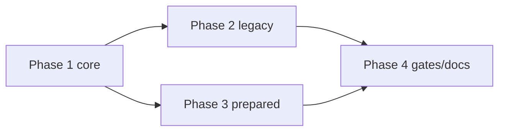

# 运行时回退修复 任务总览

> 日期: 2026-09-03 | 作者: huyongle | 关联: [../plans/README.md](../plans/README.md)

## 全局统计

| 指标 | 值 |
|------|-----|
| 总任务数 | 38 |
| 总 phase 数 | 4 |
| 预估总工时 | 46h |
| 关键路径 | phase1 → phase2 → phase4（phase3 可与 phase2 并行） |

## Phase 清单

| Phase | 文件 | 任务数 | 预估 |
|-------|------|--------|------|
| Phase 1: core 契约层 | [phase1.md](./phase1.md) | 11 | 12h |
| Phase 2: vue legacy 运行时 | [phase2.md](./phase2.md) | 11 | 14h |
| Phase 3: vue prepared 对齐 | [phase3.md](./phase3.md) | 10 | 14h |
| Phase 4: 门禁与文档 | [phase4.md](./phase4.md) | 6 | 6h |

## 跨阶段依赖图

| 目标 Phase | 依赖 Phase | 说明 |
|-----------|-----------|------|
| phase2 | phase1 | 需要 `createScopeContext`、`unbindExecutionSession`、`SESSION_DISPOSED_WRITE`、特殊变量不缓存 |
| phase3 | phase1 | 需要 `ResultMemo` 前缀失效、`ExpressionPlan.aliases`、`createLoopContext(options)` |
| phase4 | phase2, phase3 | 全量测试、基准对比、CHANGELOG、验收与复盘 |

## 执行纪律

- 每完成一个任务立即把对应 `- [ ]` 改为 `- [x]`；phase 内任务全部勾选后再 `flow.js complete`。
- 每个 phase 先写（或先改写）该 phase 的回归测试并确认在当前工作区失败，再动实现（红 → 绿）。
- 被改写的既有断言（`executor.test.ts:709-716`、`emit.test.ts:29-36`、`loop-model-event.test.ts:158-160`、`loop-context-pool.test.ts`、`no-root-watch.test.ts:355`）逐条记入 verification-report。
- 每个 phase 结束运行：对应包 `vitest run`、`tsc --noEmit`、`eslint packages/ --max-warnings 0`。

## 全局风险任务

| Phase | 任务 | 风险 | 应对 |
|-------|------|------|------|
| phase1 | T1.1 | `existing` 复用条件改动影响嵌套 `runChild`（if/loop/batch 共享会话） | 先跑 `__tests__/vm/execution-budget.test.ts`、`cancellation.test.ts`，新增"嵌套 batch 内 loop 共享 executionId"用例 |
| phase1 | T1.8 | 词法写入需要 `itemsPath`，vue LoopHandler 与 prepared LoopItemCell 传参方式不同 | `options.itemsPath` 可选，缺省走兜底失效并 emit 诊断 |
| phase2 | T2.2 | `VarioLegacyRoot` 改变 `vnode.value` 形态 | 保留 `LEGACY_HOST_MODE='inline'` 应急开关；grep 下游对 `vnode.value.type` 的依赖 |
| phase2 | T2.8 | legacy 不再 `prepareView` 后，依赖 `session.view` 的诊断（`render-error` 的 `schemaId/revision`）变空 | 诊断字段允许 undefined，测试同步调整 |
| phase3 | T3.5 | prepared 恢复 deep reactive 可能拉低 `no-root-watch` 基准 | 以 `deepStateWatch` 开关控制，基准不达标默认关闭并文档标注 |
| phase3 | T3.2 | plan id 加入别名后 `preparedViewCache`/shadow 对比命中率变化 | `compareShadowPlans` 按 source+aliases 对齐 |
| phase4 | T4.2 | 基准数据受机器负载影响 | 同机同轮各跑 3 次取 median，记录环境 |
