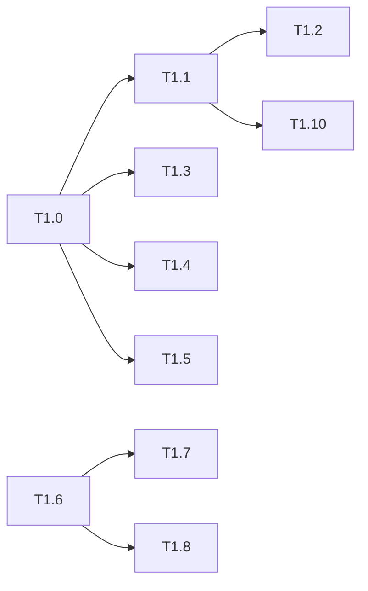

# 运行时回退修复 Phase 1: core 契约层 任务清单

> 日期: 2026-09-03 | 作者: huyongle | 关联: [../plans/README.md](../plans/README.md) · [../plans/core-runtime.md](../plans/core-runtime.md) | 上一阶段: 无

## 本阶段任务

- [x] **T1.0**: 编写 core 回归测试（红）
  - **描述**: 先落地本阶段全部回归用例并确认在当前工作区失败：两次 `execute` 独立会话；execute 后 `getExecutionSession(ctx)` 为 undefined；`_set` 在会话结束 40ms 后成功；loop 迭代共享 `executionId`；`$event.target.value` 两次求值不同；`$self.props.label` 跨节点不串；`bump('items')` 失效 `items.length`；`bump('items.0.name')` 失效 `items.0`；对象结果不入 memo；AC-5 白名单表达式；`_set('$item.done')` 写回；`users[].name` 抛 `PATH_UNRESOLVED_INDEX`；`emit` 无 data 时 payload undefined；Vue reactive 上 `getPathValue` 对不存在键的依赖收集（`effect` 触发两次）。
  - **产出物**: `packages/vario-core/__tests__/regression/execution-session.test.ts`、`expression-cache-special-vars.test.ts`、`result-memo-prefix.test.ts`、`whitelist-parity.test.ts`、`lexical-write.test.ts`、`path-tracking.test.ts`（新增）
  - **参考**: 遵循 `packages/vario-core/__tests__/vm/cancellation.test.ts` 的 `createRuntimeContext + execute` 写法；Vue 依赖收集用例参考 `packages/vario-vue/__tests__/adapter-phase2-perf.test.ts` 的 `effect` 用法
  - **复用**: `createRuntimeContext`、`execute`、`evaluate`、`ResultMemo`、`compileExpressionPlan`、`evaluateExpressionPlan`（已有导出）
  - **验收**: 新增用例在修复前全部失败，`vitest run __tests__/regression` 可执行
  - **预估**: 2h
  - **依赖**: 无

- [x] **T1.1**: ExecutionSession 解绑与复用规则
  - **描述**: `ExecutionSession` 新增 `active` 标志，`dispose()` 置 `active=false`；新增 `unbindExecutionSession(ctx)`；`getExecutionSession` 遇到 `!active || cancelled` 的会话顺手解绑并返回 undefined；`execute()` 的 `existing` 分支仅复用活跃会话，`finally` 解绑；`assertSessionCanWrite` 仅在活跃会话上 `throwIfCancelled`。
  - **产出物**: `packages/vario-core/src/vm/execution-session.ts`、`packages/vario-core/src/vm/executor.ts`（修改）
  - **参考**: 现有 `bindExecutionSession/getExecutionSession`（`execution-session.ts:147-159`）
  - **复用**: `sessions` WeakMap（已有）
  - **验收**: T1.0 的 execution-session 用例通过；`__tests__/vm/execution-budget.test.ts`、`cancellation.test.ts` 通过
  - **预估**: 1h
  - **依赖**: T1.0

- [x] **T1.2**: loop 迭代共享父会话
  - **描述**: `handlers/loop.ts` 每次迭代 `bindExecutionSession(loopCtx, session)`，`finally` 中先 `unbindExecutionSession(loopCtx)` 再 `releaseLoopContext(loopCtx)`；`runChild` 因此在 loopCtx 上命中同一会话。
  - **产出物**: `packages/vario-core/src/vm/handlers/loop.ts`（修改）
  - **参考**: `handlers/batch.ts` 对 `session` 的取用方式
  - **复用**: `getExecutionSession(ctx)`（executor 传入的 `session` 参数）
  - **验收**: 父级 + N 次迭代只有 1 个 `executionId`；`maxSteps:4` 下 3 项 × 2 action 报 `ACTION_MAX_STEPS_EXCEEDED`；文件头注释与实现一致
  - **预估**: 1h
  - **依赖**: T1.1

- [x] **T1.3**: 特殊变量表达式不缓存 + 赋值失效
  - **描述**: `evaluate.ts` 的 `LEXICAL_ROOTS`/`hasLexicalRoot` 加入 `$event/$self/$parent/$siblings/$children`；`proxy.ts` 对 allowedSpecialVars 赋值成功后 `invalidateCache(propName, proxy)`；`plan-compiler.ts` 把 `$variables/$datasources/$functions/$utils` 从 `dynamicDeps` 排除、归 `stateDeps`。
  - **产出物**: `packages/vario-core/src/expression/evaluate.ts`、`src/runtime/proxy.ts`、`src/expression/plan-compiler.ts`（修改）
  - **参考**: `evaluate.ts:21-25` 现有 lexical 判定
  - **复用**: `invalidateCache`（已有）
  - **验收**: T1.0 的 special-vars 用例通过；`__tests__/expression/cache.test.ts` 通过
  - **预估**: 1h
  - **依赖**: T1.0

- [x] **T1.4**: ResultMemo 前缀失效
  - **描述**: `ResultMemo` 新增 `knownDeps`；`store` 登记 deps 且对对象/数组/undefined 结果直接 return；`bump(path)` 对 `knownDeps` 中 `matchPath(dep, path) || matchPath(path, dep)` 的依赖递增版本并递增 `path` 自身；`clear()` 同步清空 `knownDeps`。
  - **产出物**: `packages/vario-core/src/expression/result-memo.ts`、`src/expression/plan-evaluator.ts`（修改）
  - **参考**: `cache.ts:131-150` `invalidateCache` 的匹配语义
  - **复用**: `matchPath`（`runtime/path.ts`）
  - **验收**: T1.0 的 result-memo-prefix 用例通过；`__tests__/expression/result-memo.test.ts` 通过（必要时调整命中率断言并登记）
  - **预估**: 1.5h
  - **依赖**: T1.0

- [x] **T1.5**: 白名单恢复 HEAD 可用面
  - **描述**: `policy.ts` 加 `JSON` 到 `WHITELISTED_GLOBALS`，新增 `isWhitelistedGlobalStaticCall`，`Math.random` 加回 `WHITELISTED_FUNCTIONS`；`whitelist.ts` 与 `evaluator.ts` 的检查同步放行，`reverse/sort` 仅当 `member.object.type === 'CallExpression'`；错误信息对 `reverse/sort` 提示 `slice().reverse()`。
  - **产出物**: `packages/vario-core/src/expression/policy.ts`、`whitelist.ts`、`evaluator.ts`（修改）
  - **参考**: `git show HEAD:packages/vario-core/src/expression/whitelist.ts` 的 `isGlobalFunction` 规则
  - **复用**: `FORBIDDEN_OBJECT_METHODS`、`DANGEROUS_FUNCTIONS`（已有）
  - **验收**: T1.0 的 whitelist-parity 用例通过；`__tests__/expression/whitelist.test.ts`、`__tests__/security/expression-purity.test.ts` 通过；`Object.assign/eval` 仍拒绝
  - **预估**: 1.5h
  - **依赖**: T1.0

- [x] **T1.6**: 抽出转发 ctx 原语与 `createScopeContext`
  - **描述**: 新建 `runtime/forwarding-context.ts`：`createForwardingContext(parentCtx, locals)`（抽自 `loop-context-pool.ts:80-99`）、`getParentContext(ctx)`（`parents: WeakMap`）；新建 `runtime/scope-context.ts`：`createScopeContext(parentCtx, bindings)`、`isScopeContext(ctx)`（`WeakSet`）；`loop-context-pool.ts` 改用转发原语，`releaseLoopContext` 只删登记不清空 locals；`index.ts`/`runtime/index.ts` 导出。
  - **产出物**: `packages/vario-core/src/runtime/forwarding-context.ts`、`src/runtime/scope-context.ts`（新增）；`src/runtime/loop-context-pool.ts`、`src/runtime/index.ts`、`src/index.ts`（修改）
  - **参考**: `loop-context-pool.ts` 现有 Proxy 结构与 `loopTargets` WeakMap
  - **复用**: `SYSTEM_COPY` 常量（已有）
  - **验收**: `__tests__/runtime/loop-context-pool.test.ts` 改写后通过（release 后 `$item` 仍可读）；`isScopeContext(createScopeContext(ctx, {}))` 为 true，`'$item' in scopeCtx` 为 false
  - **预估**: 1.5h
  - **依赖**: 无

- [x] **T1.7**: session/execution 查找回落父 ctx
  - **描述**: `getExecutionSession` 在原型链查找失败后调用 `getParentContext(ctx)` 继续；导出 `getParentContext` 供 vue 侧 `getPageSessionForContext` 使用（vue 侧改动在 Phase 2）。
  - **产出物**: `packages/vario-core/src/vm/execution-session.ts`（修改）
  - **参考**: `execution-session.ts:151-159` 现有原型链循环
  - **复用**: T1.6 的 `getParentContext`
  - **验收**: `getExecutionSession(createLoopContext(ctx, …))` 在父 ctx 绑定会话时返回该会话
  - **预估**: 0.5h
  - **依赖**: T1.6

- [x] **T1.8**: 词法变量子路径写入与路径策略收窄
  - **描述**: `createLoopContext(parentCtx, item, index, options?: { itemsPath, itemKey, indexKey })` 包装 `_set`：首段为 `$item`/`itemKey` 时 `setPathValue(item, rest)` 并按 `itemsPath.index.rest` `recordChange + invalidateCache`（无 `itemsPath` 时兜底失效 + 诊断）；`$index`/`indexKey` 写入抛 `PathWriteError`。`path-policy.isSystemPath` 只拦截真正系统根；`parsePath` 遇 `[]` 抛 `PATH_UNRESOLVED_INDEX`；`errors.ts` 新增 `PATH_UNRESOLVED_INDEX`、`SESSION_DISPOSED_WRITE`、`SESSION_PAUSED`。
  - **产出物**: `packages/vario-core/src/runtime/loop-context-pool.ts`、`src/runtime/path-policy.ts`、`src/runtime/path.ts`、`src/errors.ts`（修改）
  - **参考**: `create-context.ts:90-118` `_set` 的失效/记录顺序
  - **复用**: `setPathValue`、`recordChange`、`invalidateCache`、`PathWriteError`（已有）
  - **验收**: T1.0 的 lexical-write 用例通过；`__tests__/security/path-pollution.test.ts` 通过（原型污染防护不变）
  - **预估**: 1.5h
  - **依赖**: T1.6

- [x] **T1.9**: `getPathValue` 恢复依赖收集与原型 getter
  - **描述**: `path.ts` `ownGet` 改为 `isForbiddenSegment` → undefined，否则 `segment in value ? Reflect.get(value, segment) : undefined`；`lexical.ts` 同类读取同步。
  - **产出物**: `packages/vario-core/src/runtime/path.ts`、`src/runtime/lexical.ts`（修改）
  - **参考**: `git show HEAD:packages/vario-core/src/runtime/path.ts` 的直接下标读取
  - **复用**: `isForbiddenSegment`（已有）
  - **验收**: T1.0 的 path-tracking 用例通过（effect 触发两次；class getter/`Set.size` 可读）；`__tests__/security/path-pollution.test.ts` 通过
  - **预估**: 0.5h
  - **依赖**: 无

- [x] **T1.10**: emit / batch / paused / disposed 写入语义
  - **描述**: `emit.ts` 未提供 `data` 时 payload `undefined`；`batch.ts` 改为 journal 记录 `(path, oldValue)` 逆序回滚，回滚写入带 `bypassSession`，回滚在 `endChangeTransaction` 前完成，超时/abort 抛 `BatchError`；`executor.ts` paused 时 emit `SESSION_PAUSED` 诊断；`create-context.ts:_set` 与 `proxy.ts:set` 在 `isContextDisposed` 时 emit `SESSION_DISPOSED_WRITE` 并返回不抛（`execute` 仍抛 `SESSION_DISPOSED`）；改写 `__tests__/vm/handlers/emit.test.ts:29-36`、`__tests__/vm/executor.test.ts:709-716`。
  - **产出物**: `packages/vario-core/src/vm/handlers/emit.ts`、`handlers/batch.ts`、`src/vm/executor.ts`、`src/vm/execution-session.ts`（journal）、`src/runtime/create-context.ts`、`src/runtime/proxy.ts`（修改）；两处既有测试（改写）
  - **参考**: `execution-session.ts:115-129` 现有 `beginJournal` 骨架
  - **复用**: `BatchError`、`beginChangeTransaction/endChangeTransaction`（已有）
  - **验收**: `__tests__/vm/batch-atomicity.test.ts` 通过并新增"Vue reactive 嵌套路径回滚"用例；`emit` 用例按新语义通过；disposed ctx `_set` 不抛且 sink 收到 `SESSION_DISPOSED_WRITE`
  - **预估**: 1.5h
  - **依赖**: T1.1

## 本阶段预估

| 指标 | 值 |
|------|-----|
| 任务数 | 11 |
| 预估总工时 | 12h |
| 可并行任务 | T1.3 / T1.4 / T1.5 / T1.6 / T1.9 互不依赖，可并行 |

## 本阶段内依赖

