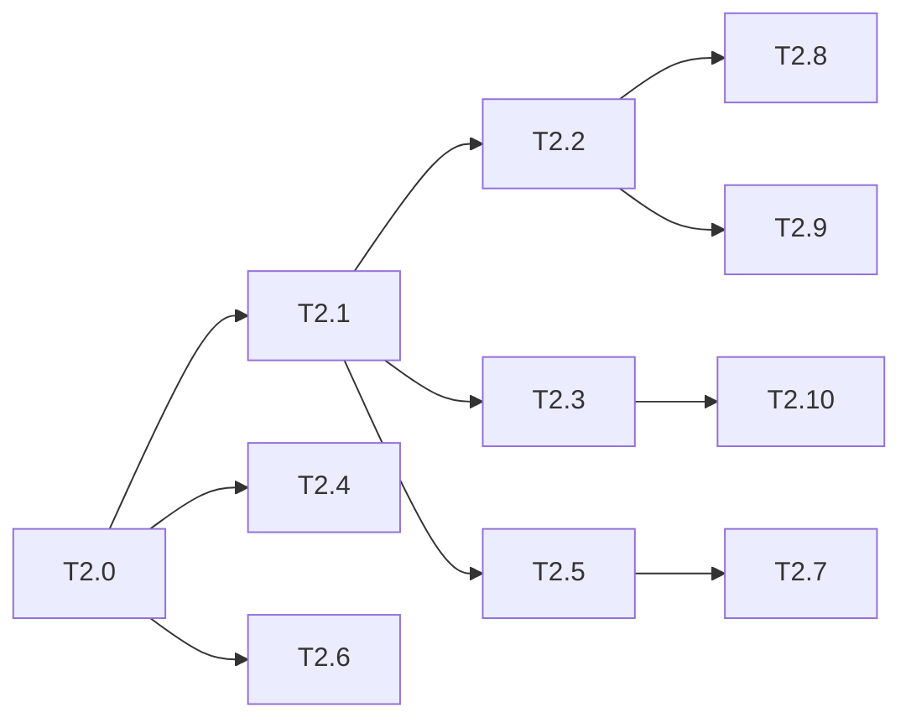

# 运行时回退修复 Phase 2: vue legacy 运行时 任务清单

> 日期: 2026-09-03 | 作者: huyongle | 关联: [../plans/README.md](../plans/README.md) · [../plans/vue-legacy-runtime.md](../plans/vue-legacy-runtime.md) | 上一阶段: [phase1.md](./phase1.md)

## 本阶段任务

- [x] **T2.0**: 编写 legacy 回归测试（红）
  - **描述**: 落地 AC-2/AC-4/AC-6/AC-7 与事件会话用例并确认当前失败：`reactive-mutation`（`state.count=20`、`state.form.name`、cond、`list.push`+`length`、`_set('items.0.name')`、`_set('form',{})`、10ms 节奏三连点 `1,2,3`）；`directive-lifecycle`（hook 序列、无 `withDirectives` 警告、单次 render 计数）；`slot-scope`（循环内 `A|A|0`/`B|B|1`、循环外 `ref` 非数组）；`shared-state-dispose`（v-if 卸载后共享对象不变、重挂载、异步回写不抛）；`event-session`（事件会话超时后 v-model 写回与 `_set` 正常；交叠异步事件后 `frames.size` 归零）。
  - **产出物**: `packages/vario-vue/__tests__/correctness/reactive-mutation.test.ts`、`directive-lifecycle.test.ts`、`slot-scope.test.ts`、`shared-state-dispose.test.ts`、`event-session.test.ts`（新增）
  - **参考**: 遵循 `packages/vario-vue/__tests__/prepared/loop-model-event.test.ts` 的 happy-dom 挂载写法（`@vitest-environment happy-dom` + `createApp(defineComponent({ setup() { useVario } }))`）
  - **复用**: `useVario`、`getPageSessionForContext`、`resetPerformanceCounters/getPerformanceCounters`（已有）
  - **验收**: 新增用例在修复前失败（`reactive-mutation` 至少 7 项、`directive-lifecycle` 1 项、`slot-scope` 1 项、`shared-state-dispose` 1 项、`event-session` 2 项）
  - **预估**: 2.5h
  - **依赖**: 无

- [x] **T2.1**: `runtimeMode` 贯穿 renderer 与 feature 模块
  - **描述**: `VueRendererOptions.runtimeMode`（默认 `'legacy'`）；`VueRenderer` 构造时把 mode 传给 `ExpressionEvaluator`、`EventHandler`、`plugins/lifecycle.ts`（`LifecycleWrapper`）；`initRenderer` 传 `resolvedRuntimeMode(options)`；`getPageSessionForContext` 增加 `getParentContext` 回落（与 core T1.7 对齐）。
  - **产出物**: `packages/vario-vue/src/renderer.ts`、`src/composables/internal/use-vario-phases.ts`、`src/features/expression-evaluator.ts`、`src/features/event-handler.ts`、`src/plugins/lifecycle.ts`、`src/features/lifecycle-wrapper.ts`、`src/runtime/page-session.ts`（修改）
  - **参考**: `runtime/runtime-mode.ts` 的 `RuntimeMode` 类型；`use-vario-phases.ts:42-46` `resolvedRuntimeMode`
  - **复用**: `getParentContext`（Phase 1 T1.6）
  - **验收**: `tsc --noEmit` 通过；既有 `renderer.test.ts` 通过
  - **预估**: 1h
  - **依赖**: 无（core 已完成）

- [x] **T2.2**: `VarioLegacyRoot` 承载 legacy 渲染
  - **描述**: 新增 `components/legacy-root.ts`；`createRenderWithErrorBoundary` 改为返回 `VNode | null`（保留 `errorRef`/`onRecover`/`fallback` 逻辑）；`composable.ts` legacy 分支：有实例时 `publicVnode.value = h(VarioLegacyRoot, { key, renderFn, revision })`，scheduler/`retry`/`patchNode` 只递增 `revision`；无实例时保留直出；`renderer.instance` 改为惰性 `getCurrentInstance()` 供 `attachRef`；保留 `LEGACY_HOST_MODE` 应急常量。
  - **产出物**: `packages/vario-vue/src/components/legacy-root.ts`（新增）；`src/composable.ts`、`src/composables/internal/use-vario-phases.ts`、`src/renderer.ts`、`src/features/refs.ts`（修改）
  - **参考**: `components/vario-root.ts` 与 `composable.ts:200-238` prepared 分支
  - **复用**: `createDefaultErrorVNode`（已有）
  - **验收**: T2.0 的 `directive-lifecycle` 通过；`__tests__/renderer.test.ts`、`__tests__/vue-features.test.ts`、`__tests__/directives.test.ts`、`__tests__/composable-enhanced.test.ts` 通过；一次 `_set` 只触发一次 `legacyRenderNode` 根计数
  - **预估**: 3h
  - **依赖**: T2.1

- [x] **T2.3**: ExpressionEvaluator / provide-inject 按模式分流 + 白名单告警
  - **描述**: `evaluateExpr`：legacy → `evaluate()`；prepared → `evaluateExpressionPlan()`；`provide-inject.ts` 通过 evaluator 求值；catch 中对 `ExpressionError`（校验类）按表达式去重 `console.warn` 一次。
  - **产出物**: `packages/vario-vue/src/features/expression-evaluator.ts`、`src/features/provide-inject.ts`（修改）
  - **参考**: `expression-evaluator.ts:21-31` 现有分支
  - **复用**: `evaluate`、`ExpressionError`、`ErrorCodes`（core 已有）
  - **验收**: T2.0 的 `reactive-mutation` 全部通过；`{{ Object.assign({}, x) }}` 触发一次 warn
  - **预估**: 1h
  - **依赖**: T2.1

- [x] **T2.4**: 作用域插槽改用 `createScopeContext`，移除插槽函数缓存
  - **描述**: `children-resolver.ts:104` 改为 `createScopeContext(ctx, { [n]: scope })`；删除 `q` WeakMap 与 `hit/s` 复用逻辑，恢复每帧重建插槽函数；`event-handler.ts:307` `isInScopedSlot = isScopeContext(ctx)`。
  - **产出物**: `packages/vario-vue/src/features/children-resolver.ts`、`src/features/event-handler.ts`（修改）
  - **参考**: `git show HEAD:packages/vario-vue/src/features/children-resolver.ts` 的插槽结构
  - **复用**: `createScopeContext`、`isScopeContext`（Phase 1 T1.6）
  - **验收**: T2.0 的 `slot-scope` 通过；`__tests__/correctness/loop-slot-scope.test.ts`、`__tests__/event-syntax.test.ts` 通过
  - **预估**: 1h
  - **依赖**: 无（core 已完成）

- [x] **T2.5**: 事件 frame 按 id 释放
  - **描述**: `PageSession` 新增 `createEventFrame(bindings)`/`releaseFrame(frame)`；`event-handler.ts` 事件路径改用之，`finally` 按 id 释放，删除 `parentFrame`/`SCOPE_STALE_GENERATION` 检查；legacy 模式事件不创建 frame。
  - **产出物**: `packages/vario-vue/src/runtime/page-session.ts`、`src/features/event-handler.ts`（修改）
  - **参考**: `page-session.ts:184-199` 现有 `pushScope/popScope`
  - **复用**: `createScopeFrame`、`releaseScopeFrame`（core 已有）
  - **验收**: T2.0 的 `event-session` frame 用例通过；`__tests__/runtime/page-session.test.ts` 新增 `createEventFrame/releaseFrame` 用例通过
  - **预估**: 1h
  - **依赖**: T2.1

- [x] **T2.6**: dispose 不破坏宿主对象
  - **描述**: `adapter.release()` 只置 `held = null`；`PageSession.dispose()` 删除 `delete methods[key]`；`composable.dispose()` 删除清空 `reactiveState` 循环；依赖 Phase 1 的 disposed 写入不抛语义。
  - **产出物**: `packages/vario-vue/src/adapter.ts`、`src/runtime/page-session.ts`、`src/composable.ts`（修改）
  - **参考**: `adapter.ts:76-89`、`page-session.ts:257-264`
  - **复用**: —
  - **验收**: T2.0 的 `shared-state-dispose` 通过；`__tests__/runtime/resource-ownership.test.ts`、`session-lifecycle.test.ts` 通过（若断言"state 被清空"需改写并登记）
  - **预估**: 1h
  - **依赖**: 无

- [x] **T2.7**: 事件会话超时后写回可用（集成验证）
  - **描述**: 基于 Phase 1 T1.1，在 vue 集成层验证：事件 `execute` 结束后 `createModelBinding.updateHandler` 与宿主 `_set` 正常；`executeInstructions` 不再持有 `parentFrame`。
  - **产出物**: 无新增源码（如需，`src/features/event-handler.ts` 微调）
  - **参考**: `bindings.ts:246-262`
  - **复用**: Phase 1 成果
  - **验收**: T2.0 的 `event-session` 超时用例通过；`__tests__/model-lazy.test.ts`、`model-modifiers.test.ts` 通过
  - **预估**: 0.5h
  - **依赖**: T2.5

- [x] **T2.8**: legacy 不再 prepareView / 不建 bridge
  - **描述**: `composable.ts` legacy 分支 `view = null`（shadow/prepared 保持）；`PageSession` 在 `view === null` 时 `bridge = null`，`store.subscribe` 回调跳过 `bridge.apply`；`render-error` 诊断的 `schemaId/revision` 允许 undefined。
  - **产出物**: `packages/vario-vue/src/composable.ts`、`src/runtime/page-session.ts`、`src/composables/internal/use-vario-phases.ts`（修改）
  - **参考**: `composable.ts:239-249`
  - **复用**: —
  - **验收**: legacy 下 spy `VueStateBridge.prototype.apply` 调用次数为 0；`__tests__/runtime/runtime-metrics.test.ts` 通过
  - **预估**: 1h
  - **依赖**: T2.2

- [x] **T2.9**: 深度扫描结果缓存
  - **描述**: `renderer.render` 的 `scanSchemaIterative` 结果缓存于 `WeakMap<SchemaNode, ScanResult>`；新增 `renderer.invalidateScan(root)`，`useSchemaQuery.patchNode` 与 `onSchemaPatch` 路径调用它。
  - **产出物**: `packages/vario-vue/src/renderer.ts`、`src/composable.ts`（修改）
  - **参考**: `renderer.ts:227-241`
  - **复用**: `scanSchemaIterative`、`DEFAULT_MOUNT_MAX_DEPTH`（core 已有）
  - **验收**: `__tests__/correctness/depth-render.test.ts` 通过；patch 后深度变化仍能触发 `SchemaDepthError`
  - **预估**: 0.5h
  - **依赖**: T2.2

- [x] **T2.10**: 生产环境 flushPending 去全量失效
  - **描述**: `setupWatchers` 在无 `onTrigger`（生产）时不再对每次变更 `invalidateTopLevel`；改为依赖 `_set/recordChange` 已做的失效，仅当 `invalidationController` 标记 `forceInvalidateAll` 时全量。
  - **产出物**: `packages/vario-vue/src/composables/internal/use-vario-phases.ts`、`src/composables/internal/invalidation-controller.ts`（修改）
  - **参考**: `use-vario-phases.ts:287-310`
  - **复用**: `invalidationController.flushPending`（已有）
  - **验收**: `NODE_ENV=production` 下 T2.0 的 `reactive-mutation` 仍通过（直接改 state 时需保留一次根键失效，用例覆盖）
  - **预估**: 1.5h
  - **依赖**: T2.3

## 本阶段预估

| 指标 | 值 |
|------|-----|
| 任务数 | 11 |
| 预估总工时 | 14h |
| 可并行任务 | T2.4 / T2.6 与 T2.1–T2.3 并行；T2.9 / T2.10 与 T2.5–T2.8 并行 |

## 本阶段内依赖

