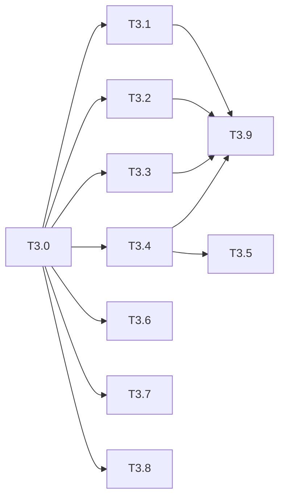

# 运行时回退修复 Phase 3: vue prepared 对齐 任务清单

> 日期: 2026-09-03 | 作者: huyongle | 关联: [../plans/README.md](../plans/README.md) · [../plans/prepared-runtime.md](../plans/prepared-runtime.md) | 上一阶段: [phase2.md](./phase2.md)（可与 Phase 2 并行，仅依赖 Phase 1）

## 本阶段任务

- [x] **T3.0**: 编写 prepared 回归测试（红）
  - **描述**: 落地 AC-8/AC-11 用例并确认当前失败：`loop-alias`（`itemKey:'user'` 输出 `['A','B']`；嵌套 loop 别名不串）；`loop-event-ctx`（点击第二行 `$item.name==='B'`、`$index===1`；loop 模板含组件化子树时 `{{ $item.name }}` 可用）；`lifecycle-ctx`（循环内 `onMounted` 收到对应 `$item`；`app.component('Card')` 可解析；`ref` 可用）；`bridge-deps`（`{{ list.slice(0,5) }}` 循环刷新、`model:'form.name'` 写回刷新、直接改 state 刷新）；`schema-replace`；`virtual-default`（500 项全量 + `LOOP_LARGE_LIST`）；SSR hydrate 后 `_set` 不抛；engine 表大小与 materials 保留。
  - **产出物**: `packages/vario-vue/__tests__/prepared/loop-alias.test.ts`、`loop-event-ctx.test.ts`、`lifecycle-ctx.test.ts`、`bridge-deps.test.ts`、`schema-replace.test.ts`、`virtual-default.test.ts`（新增）；`__tests__/ssr/*.test.ts`、`__tests__/runtime/page-session.test.ts`（扩展）
  - **参考**: `packages/vario-vue/__tests__/prepared/loop-model-event.test.ts` 的 `setRuntimeMode('prepared')` 包裹写法
  - **复用**: `useVario`、`setRuntimeMode/getRuntimeMode`、`createReferenceVirtualAdapter`、`registerEngineMaterial`（已有）
  - **验收**: 新增用例在修复前全部失败
  - **预估**: 2.5h
  - **依赖**: 无

- [x] **T3.1**: LoopItemCell ctx 跟随组件生命周期
  - **描述**: `components/loop-item-cell.ts` 在 `setup` 中持有 `loopCtx`，item/index 变化时重建，`onBeforeUnmount` 释放；`createLoopContext` 传 `{ itemsPath: plan.itemsSource, itemKey, indexKey }`；`prepared-renderer.ts` 拦截器改为按 `loopDescendant` 集合判定（`indexView` 预计算）。
  - **产出物**: `packages/vario-vue/src/components/loop-item-cell.ts`、`src/runtime/prepared-renderer.ts`、`src/runtime/page-session.ts`（修改）
  - **参考**: `features/loop-item-cell.ts`（legacy cell 不释放 ctx 的做法）
  - **复用**: `createLoopContext(options)`、`releaseLoopContext`（Phase 1 T1.8）
  - **验收**: T3.0 的 `loop-event-ctx` 通过；`__tests__/prepared/loop-model-event.test.ts`、`nested-loop.test.ts` 通过；`__varioLiveLoopItemCells` 计数在卸载后归零
  - **预估**: 2h
  - **依赖**: 无

- [x] **T3.2**: 别名进入 localDeps
  - **描述**: `compileExpressionPlan(source, { aliases })`：`localDeps` 判定含 aliases，plan id 含排序后的 aliases；`ExpressionPlan.aliases` 类型；`prepare-view.ts` 自顶向下传递祖先 loop 别名给 `compileExpressionSources` 与 `compileLoopPlan`；`shadow-comparator.ts` 对齐 plan id 规则。
  - **产出物**: `packages/vario-core/src/expression/plan-compiler.ts`、`packages/vario-types/src/prepared.ts`、`packages/vario-schema/src/compiler/prepare-view.ts`、`prepare-expression.ts`、`prepare-loop.ts`、`packages/vario-vue/src/runtime/shadow-comparator.ts`（修改）
  - **参考**: `plan-compiler.ts:33-55`、`prepare-view.ts:147-170`
  - **复用**: `extractDependencies`（已有）
  - **验收**: T3.0 的 `loop-alias` 通过；`packages/vario-schema/__tests__/compiler/loop-slot-plan.test.ts`、`prepare-view.test.ts`、`packages/vario-vue/__tests__/runtime/shadow-comparator.test.ts` 通过
  - **预估**: 2h
  - **依赖**: 无

- [x] **T3.3**: lifecycle ctx / instance / refs / 组件解析
  - **描述**: `lifecycle-wrapper.ts` 优先 `props.runtimeCtx`/`props.schema`；`composable.ts` prepared 分支 `initRenderer(instance, …)`；`refs.ts` owner 为空时 `getCurrentInstance()` 兜底；`ComponentResolver` 在 `appComponents` 为空时用 `getCurrentInstance()?.appContext.components` 兜底一次。
  - **产出物**: `packages/vario-vue/src/features/lifecycle-wrapper.ts`、`src/composable.ts`、`src/features/refs.ts`、`src/features/component-resolver.ts`（修改）
  - **参考**: `lifecycle-wrapper.ts:48-56`、`refs.ts:149-153`
  - **复用**: `getCurrentInstance`（vue）
  - **验收**: T3.0 的 `lifecycle-ctx` 通过；`__tests__/correctness/lifecycle-identity.test.ts`、`__tests__/features/refs.test.ts` 通过
  - **预估**: 1.5h
  - **依赖**: 无

- [x] **T3.4**: state-bridge 依赖匹配补全
  - **描述**: `apply` 的 loop 匹配改用 `itemsPlanId` 对应 plan 的 `stateDeps` 双向前缀匹配；节点匹配并入 `modelPlans[].path`；`flushedIds` 改为按 `changeSet.id` 去重。
  - **产出物**: `packages/vario-vue/src/runtime/state-bridge.ts`（修改）
  - **参考**: `state-bridge.ts:43-78`
  - **复用**: `matchPath`（core）、`node.modelPlans`（prepare-view 已产出）
  - **验收**: T3.0 的 `bridge-deps` 中 `slice` 循环与 `model` 写回两项通过；`__tests__/runtime/state-bridge.test.ts` 通过
  - **预估**: 1.5h
  - **依赖**: 无

- [x] **T3.5**: prepared 直接改 state 路由（带开关）
  - **描述**: `UseVarioOptions.runtimeBudget.deepStateWatch?: boolean`；开启时 prepared 的 state 用 `reactive` 且 `setupWatchers` 启用 sync deep watch，回调把采集路径 `recordChange` 到 ctx（采集不到时 `memo.nextGeneration()` + 根 token bump）；`onNamespacesChange` 回调同步 `memo.bump`；跑 `no-root-watch` 同类基准决定默认值并写入文档。
  - **产出物**: `packages/vario-vue/src/types.ts`、`src/composables/internal/use-vario-phases.ts`、`src/runtime/page-session.ts`（修改）
  - **参考**: `use-vario-phases.ts:273-310`；`invalidation-controller.ts`
  - **复用**: `invalidationController.collectFromTrigger/flushPending`、`recordChange`（已有）
  - **验收**: 开关开启时 T3.0 的 `bridge-deps` 直接改 state 项通过；`__tests__/prepared/no-root-watch.test.ts` 去掉计时门禁后通过；基准数据记入 verification
  - **预估**: 2h
  - **依赖**: T3.4

- [x] **T3.6**: schema 根替换重建 view
  - **描述**: `composable.ts` prepared scheduler 回调检测 `schemaRef.value !== lastRoot` → 重新 `adaptLegacySchema`，`session.view/indexView/bridge` 重建后 `viewRevision++`。
  - **产出物**: `packages/vario-vue/src/composable.ts`、`src/runtime/page-session.ts`（修改）
  - **参考**: `composable.ts:200-220`
  - **复用**: `adaptLegacySchema`、`installRegionInterceptor`（已有）
  - **验收**: T3.0 的 `schema-replace` 通过
  - **预估**: 1h
  - **依赖**: 无

- [x] **T3.7**: 默认 virtualAdapter 为 null + 大列表诊断
  - **描述**: `PageSession` 默认 `virtualAdapter = null`；`LoopRegion` 超过 `budget.maxLoopItems ?? 1000` 时 emit `LOOP_LARGE_LIST` 不截断；显式传 reference adapter 行为不变；改写 `__tests__/prepared/loop-model-event.test.ts:158-160`。
  - **产出物**: `packages/vario-vue/src/runtime/page-session.ts`、`src/components/loop-region.ts`（修改）；`__tests__/prepared/loop-model-event.test.ts`（改写）
  - **参考**: `page-session.ts:85-87`、`loop-region.ts:120-125`
  - **复用**: `createReferenceVirtualAdapter`（保留为显式选项）
  - **验收**: T3.0 的 `virtual-default` 通过；`__tests__/prepared/virtual-list.test.ts` 通过
  - **预估**: 1h
  - **依赖**: 无

- [x] **T3.8**: SSR ctx 复用与 engine 生命周期
  - **描述**: `renderSsrToString` 不 dispose 传入 ctx（改 `deactivate` 或由调用方负责）；`engineId ?? 'default'`；`dispose()` 不 `materials.clear()`；`RuntimeSession.dispose` 在非 default engine 无会话时删除 engine 条目。
  - **产出物**: `packages/vario-vue/src/ssr/create-ssr-session.ts`、`src/runtime/page-session.ts`、`packages/vario-core/src/runtime/runtime-session.ts`（修改）
  - **参考**: `create-ssr-session.ts:39-60`、`runtime-session.ts:20-28,64-72`
  - **复用**: `getOrCreateEngine`（已有）
  - **验收**: T3.0 的 SSR/engine 用例通过；`__tests__/ssr/*.test.ts`、`__tests__/runtime/session-lifecycle.test.ts` 通过
  - **预估**: 1h
  - **依赖**: 无

- [x] **T3.9**: legacyRequired 判定与 feature-parity 扩展
  - **描述**: 在 T3.1–T3.4 完成前，`prepare-view.ts` 把"loop 模板含 `ref`""作用域插槽含表达式"标记 `LEGACY_REQUIRED`；完成后按 `feature-parity.test.ts` 扩展（同一 schema 在两种模式下断言相同 DOM 与 hook 序列）逐项解除。
  - **产出物**: `packages/vario-schema/src/compiler/prepare-view.ts`、`prepare-slot.ts`（修改）；`packages/vario-vue/__tests__/prepared/feature-parity.test.ts`（扩展）
  - **参考**: `prepare-view.ts:155-166,213-221` 现有 `LEGACY_REQUIRED` 诊断
  - **复用**: `slotRequiresLegacy/loopRequiresLegacy`（已有）
  - **验收**: feature-parity 新增场景在两种模式下一致
  - **预估**: 1.5h
  - **依赖**: T3.1、T3.2、T3.3、T3.4

## 本阶段预估

| 指标 | 值 |
|------|-----|
| 任务数 | 10 |
| 预估总工时 | 14h |
| 可并行任务 | T3.1 / T3.2 / T3.3 / T3.4 / T3.6 / T3.7 / T3.8 互不依赖，可并行 |

## 本阶段内依赖

