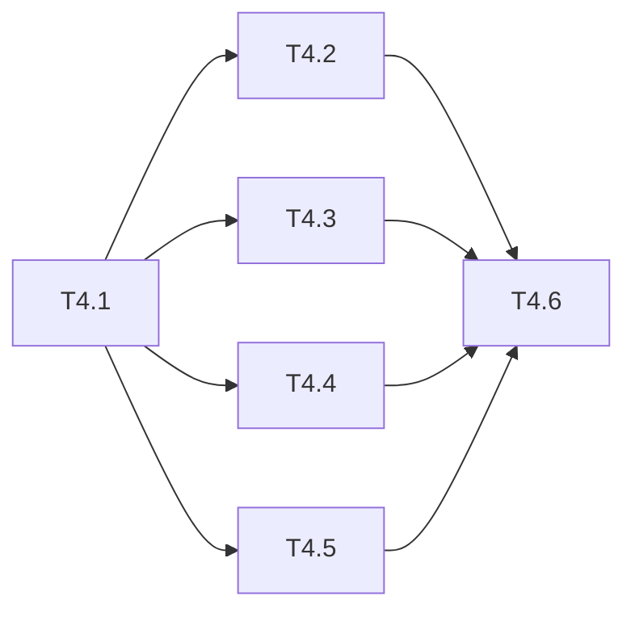

# 运行时回退修复 Phase 4: 门禁与文档 任务清单

> 日期: 2026-09-03 | 作者: huyongle | 关联: [../plans/README.md](../plans/README.md) | 上一阶段: [phase3.md](./phase3.md)

## 本阶段任务

- [x] **T4.1**: 依赖安装与全量测试门禁
  - **描述**: 根目录 `pnpm install` 修复 `packages/vario-core/node_modules` 缺 vitest；运行 `pnpm test`（vue/core/schema/types/cli）、`pnpm test:integration`；确认 Phase 1–3 新增回归测试全部通过、被改写的既有断言无遗漏。
  - **产出物**: 无源码；测试运行记录写入 `../verification-report.md` 草稿
  - **参考**: 根 `package.json` scripts
  - **复用**: —
  - **验收**: 全部测试文件通过；`pnpm --filter @variojs/core test` 不再 MODULE_NOT_FOUND
  - **预估**: 1h
  - **依赖**: Phase 2、Phase 3 完成

- [x] **T4.2**: 性能基准对比
  - **描述**: 运行 `packages/vario-vue/__tests__/comprehensive-perf-report.test.ts` 三轮取 median，对比 spec 记录的基线（1000 项追加 11.35ms、5000 项初始 40.95ms、8 层深嵌套 7.88ms、仪表盘首行 15.43ms），确认劣化 ≤ 10%；记录 prepared `deepStateWatch` 开/关的 `no-root-watch` 同类数据并据此定默认值。
  - **产出物**: `../verification-report.md`（基准表）；如需调整默认值：`packages/vario-vue/src/composables/internal/use-vario-phases.ts`
  - **参考**: research-report "性能/安全基准"
  - **复用**: `comprehensive-perf-report.test.ts` 的 JSON 输出（`===JSON_END===` 之前）
  - **验收**: 四场景均 ≤ 基线 × 1.10；legacy 下 spy `VueStateBridge.apply` 为 0 次
  - **预估**: 1h
  - **依赖**: T4.1

- [x] **T4.3**: 静态门禁
  - **描述**: 五包 `tsc --noEmit`；`eslint packages/ --max-warnings 0`；`pnpm build` 产出 dist 并用 `node --input-type=module` 冒烟：`execute` 两次、`$event` 两次求值、`emit` 默认 payload、`_set('$item.done')`。
  - **产出物**: 无源码；冒烟脚本放 `/tmp`，结果记入 verification-report
  - **参考**: 本次审查使用的 dist 冒烟命令
  - **复用**: `scripts/build.mjs`
  - **验收**: 0 error / 0 warning；dist 冒烟四项符合 spec
  - **预估**: 0.5h
  - **依赖**: T4.1

- [x] **T4.4**: 文档更新
  - **描述**: `docs/guide/node-context.md` 标注 prepared 下 `$children/$siblings` 为只读视图；`docs/api/use-vario.md` 标注 `vnode.value` 在有实例的 legacy 模式下为 `VarioLegacyRoot` 组件 vnode、`watch(schemaRef)` 非 deep（就地改 schema 需 `patchNode` 或换引用）、prepared 模式 `deepStateWatch` 语义；表达式文档补白名单清单（含 `reverse/sort` 仅链式）；`emit` 默认 payload 说明。
  - **产出物**: `docs/guide/node-context.md`、`docs/api/use-vario.md`、`docs/guide/expression*.md`（按现有文件名）、`docs/api/action-reference.md`（修改）
  - **参考**: 现有 docs 章节结构
  - **复用**: —
  - **验收**: 文档描述与 Phase 1–3 实现逐条一致；`pnpm build:docs` 通过
  - **预估**: 1.5h
  - **依赖**: T4.1

- [x] **T4.5**: CHANGELOG 追加
  - **描述**: 在 `CHANGELOG.md` `Unreleased` 下追加本次修复条目（Fixed：ExecutionSession 解绑、legacy memo 回退、指令持续生效、dispose 不清空宿主 state、作用域插槽 ctx、白名单恢复、`$event` 缓存、`$item.*` 写入、prepared 循环 ctx/别名/lifecycle/instance；Changed：`vnode.value` 形态、`emit` 默认 payload、prepared 默认 `virtualAdapter=null`、`watch(schemaRef)` 非 deep）。现有 CHANGELOG 使用 `## Unreleased` + 日期小节，不符合 Keep a Changelog 的 `## [Unreleased]` / `### Added|Changed|Fixed` 分类（`validate.js --strict` 当前报 2 项失败）；本任务顺带把 `Unreleased` 区块整理为标准分类，否则 Phase 7 门控无法通过。
  - **产出物**: `CHANGELOG.md`（修改）
  - **参考**: 现有 `### 2026-09-01 门禁闭环与验收落地` 条目风格；`uluo-spec-driven/examples/changelog-template.md`
  - **复用**: —
  - **验收**: `validate.js --strict` CHANGELOG 步骤通过
  - **预估**: 0.5h
  - **依赖**: T4.1

- [x] **T4.6**: 验收报告与复盘
  - **描述**: 按 spec AC-1…AC-11 逐条对照写 `verification-report.md`（含被改写断言清单、基准表、待确认项结论）；写 `retrospective.md`（为何 838 个测试没拦住回退、如何在 CI 增加"真实节奏事件"与"直接改 state"用例类别）。
  - **产出物**: `specs/runtime-regression-fix/verification-report.md`、`specs/runtime-regression-fix/retrospective.md`（新增）
  - **参考**: `uluo-spec-driven/examples/verification-report-template.md`、`retrospective-template.md`
  - **复用**: T4.1–T4.3 记录
  - **验收**: `flow.js complete 8`、`complete 9` 门控通过
  - **预估**: 1.5h
  - **依赖**: T4.2、T4.3、T4.4、T4.5

## 本阶段预估

| 指标 | 值 |
|------|-----|
| 任务数 | 6 |
| 预估总工时 | 6h |
| 可并行任务 | T4.2 / T4.3 / T4.4 / T4.5 可并行 |

## 本阶段内依赖

